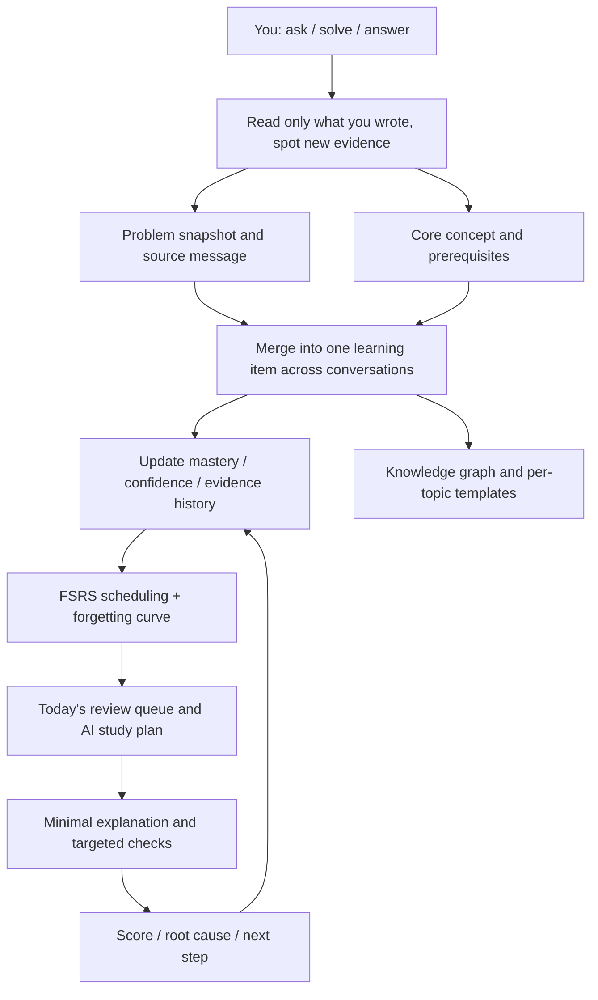

<p align="center">
  
</p>

<h1 align="center">LeetLens</h1>

<p align="center">
  A LeetCode practice client for learning algorithms. AI turns your questions, chats, and submissions into a knowledge map and a review queue.
</p>

<p align="center">
  
  
  
  <a href="LICENSE"></a>
  <a href="https://github.com/huaxx-lab/LeetLens/stargazers"></a>
</p>

<p align="center">
  <a href="https://github.com/huaxx-lab/LeetLens/releases/latest"><b>Download</b></a> ·
  <a href="#what-it-does">What it does</a> ·
  <a href="#screenshots">Screenshots</a> ·
  <a href="#install">Install</a> ·
  <a href="#optional-services">Optional services</a> ·
  <a href="README.md">简体中文</a>
</p>

---

LeetLens is a practice client for [leetcode.cn](https://leetcode.cn), built for people learning algorithms. You write, run, and submit in the app. AI turns that work into knowledge: it reads your questions and conversations, cross-checks submission history, extracts what you actually do not know, draws it on a map, and schedules review. When you need an explanation, it looks up editorials and videos.



<p align="center">
  
</p>
<p align="center"><sub>The map grows from questions, chat, and submissions. Percentages are roughly how much you'd still remember today.</sub></p>

## What it does

**Chat**

- Questions about *your* mastery, a specific submission, or today's plan are answered from local data, not invented.
- It can search community editorials on leetcode.cn (official first) and public Bilibili videos. Citations render as cards and open on the right.
- The first time you open chat each day, you get a local briefing: today's queue and the items most worth reinforcing. No model call, no quota used.
- Streaming, stoppable any time. Reasoning effort: off / low / high / max. Context usage is visible.
- It can remember who you are, how you like answers, and what you discussed before. Those long-term facts are listed in Settings and can be deleted.

**Practice**

- Sign in to leetcode.cn in the built-in browser (WeChat / QQ popups work), import a list, and sync submissions per problem.
- Run samples and submit in-app. Compile errors, failing cases, pass counts, time and memory are all parsed.
- The editor supports Java, C++, Python, JavaScript, and TypeScript, with local syntax checks and formatting. Wire up Eclipse JDT LS for Java type and API completion.
- Official and community editorials open in place, images go into a carousel, editorial videos play inline.
- Submission heatmap, streaks, difficulty spread.

**Study**

- AI judges mastery from questions, chat, and submission history. The model's answers do not count as yours.
- Essential gaps land on the knowledge map. The same topic merges across conversations instead of spawning duplicate cards.
- Review items are added for you. Today's queue is by quota, overdue and most-forgotten first. Exercises are multiple choice, short answer, fill-in-the-code, or a full problem. Scores write back the next due date. Self-grading is allowed.
- Once a topic has enough problems, it distills when the pattern applies, the steps, common traps, and a compilable skeleton.
- Insights and a study plan (edit the calendar yourself; AI can suggest *what* to study, clock times follow your quota).

The right column is a real browser: tabs, logins, restored after relaunch. Background tabs pause instead of keeping video playing.

## Screenshots

<table>
<tr>
<td width="50%" align="center"><br><sub>Each submission reviewed on its own, ending in what to reinforce and what to do next</sub></td>
<td width="50%" align="center"><br><sub>Practice-page hints: direction first, then the sticking point, never the full solution</sub></td>
</tr>
<tr>
<td width="50%" align="center"><br><sub>Official editorial first, the rest by views; open a card to read it on the right</sub></td>
<td width="50%" align="center"><br><sub>Search walkthrough videos against how you actually failed the problem</sub></td>
</tr>
<tr>
<td width="50%" align="center"><br><sub>An editor you can write in; JDT LS adds Java type completion</sub></td>
<td width="50%" align="center"><br><sub>Edit the calendar yourself, or let AI fill a week against your quota</sub></td>
</tr>
<tr>
<td width="50%" align="center"><br><sub>Percentages are roughly how much you'd still remember today, not the score when you learned it</sub></td>
<td width="50%" align="center"><br><sub>Chat on the left, browser on the right — editorials stay in the app</sub></td>
</tr>
</table>

## Install

Grab the `.dmg` from [Releases](https://github.com/huaxx-lab/LeetLens/releases/latest) (Apple Silicon, macOS 15+) and drag it into Applications.

Ad-hoc signed, not notarized. First launch: right-click → Open. If macOS says it's damaged:

```bash
xattr -dr com.apple.quarantine "/Applications/LeetLens.app"
```

Then:

1. Settings → Providers. Pick DeepSeek, Aliyun, OpenCode Go, or add an OpenAI-compatible endpoint. Keys go in the system keychain; the UI only says "configured".
2. Sign in to leetcode.cn in the browser on the right.
3. Import a list, or sync submissions.

Data lives in `~/Library/Application Support/leetcode-ai-helper/` and survives reinstalls and rebuilds. Strip accounts, code, and credentials before sharing logs.

Different tasks can use different models (main chat, titles, learning analysis, exercises, grading, submission review, and so on). Usage is counted per conversation, task, and provider. Only provider-reported numbers are marked exact; everything else is an estimate.

## Build it yourself

You need a full Xcode with the Swift 6 toolchain, not just Command Line Tools.

```bash
git clone https://github.com/huaxx-lab/LeetLens.git
cd LeetLens/native
swift build && swift test
./scripts/build-release-app.sh   # .app + zip + dmg
```

If the repo lives in an iCloud-managed folder, resource bundles pick up extended attributes and signing fails. Point the build directory somewhere else:

```bash
swift build --scratch-path /tmp/lc-build
```

| Command | What it does |
| --- | --- |
| `cd native && swift build` | Build the current client |
| `cd native && swift test` | Native tests |
| `native/scripts/build-release-app.sh` | Release package |
| `npm test` / `npm start` | Legacy Electron client (`src/`, 1.x, not the release target) |

## Optional services

Nothing extra is required on a single machine. Chat, practice, and review all run against local files. The three services below are optional upgrades; if they go down the app falls back to disk and keeps working.

| Service | What it does | If you skip it |
| --- | --- | --- |
| Redis | Hot cache for submission analysis, submission details, and usage counters, shared across machines | Timed out, breaker trips, local files |
| PostgreSQL + pgvector | Shared vector store for cross-conversation retrieval | That layer pauses for about two minutes, retrieval uses the local vector cache |
| Eclipse JDT LS | Java type and API completion | Local syntax check and basic completion still work |

All three listen on `127.0.0.1` only. The client reaches them over SSH local forwarding. **Do not open 6379 / 5432 / 9092 on a firewall.**

Scripts live in [`scripts/remote-services`](scripts/remote-services) (Redis + pgvector) and [`scripts/remote-lsp`](scripts/remote-lsp) (Java completion).

### Redis and pgvector

You need a Debian / Ubuntu box with Docker.

```bash
scp -r scripts/remote-services ubuntu@example.com:/tmp/leetcode-services
ssh ubuntu@example.com
cd /tmp/leetcode-services

cp .env.example .env
# Fill REDIS_PASSWORD / POSTGRES_USER / POSTGRES_PASSWORD
# openssl rand -base64 24 is enough
chmod 600 .env

docker compose up -d
docker compose ps
```

Check that they are up:

```bash
docker compose exec redis redis-cli -a "$REDIS_PASSWORD" ping
# PONG

docker compose exec postgres psql -U "$POSTGRES_USER" -d leetcode_rag \
  -c "SELECT extname FROM pg_extension WHERE extname = 'vector';"
# vector
```

Open a tunnel on your Mac and leave it running:

```bash
ssh -f -N -L 6379:127.0.0.1:6379 -L 5432:127.0.0.1:5432 ubuntu@example.com
```

In the app, **Settings → Data & Cache**:

1. Enable Redis. Host `127.0.0.1`, port `6379`, the password from `.env`. Test connection.
2. Enable the vector database. Host `127.0.0.1`, port `5432`, database `leetcode_rag`, same user and password as `.env`. Test connection.
3. Save. Passwords go in the keychain.

The app creates the tables itself. `init-pgvector.sql` just sets up the neighbor index on first deploy.

Logs, upgrades, stop:

```bash
docker compose logs -f --tail 100
docker compose pull && docker compose up -d
docker compose down    # volumes keep the data
```

Backup the vector store:

```bash
docker compose exec -T postgres pg_dump -U "$POSTGRES_USER" leetcode_rag \
  | gzip > rag-$(date +%F).sql.gz
```

Redis is reconstructible cache; no need to back it up. Flushing it only makes the next analysis recompute:

```bash
docker compose exec redis redis-cli -a "$REDIS_PASSWORD" --scan --pattern 'lca:*' \
  | xargs -r docker compose exec -T redis redis-cli -a "$REDIS_PASSWORD" del
```

### Java completion (Eclipse JDT LS)

The practice editor ships with a local syntax checker. Type and API completion needs Eclipse JDT LS on a Linux host. The app opens the SSH tunnel itself — you do not run `ssh -L` for this one.

On the server (Debian / Ubuntu, with `sudo`):

```bash
scp -r scripts/remote-lsp ubuntu@example.com:/tmp/leetcode-lsp
ssh ubuntu@example.com
cd /tmp/leetcode-lsp
sudo bash install.sh
sudo systemctl status leetcode-lsp
curl http://127.0.0.1:9092/health
```

`install.sh` installs OpenJDK 21 and Eclipse JDT LS, then enables the `leetcode-lsp` unit. It binds `127.0.0.1:9092` only.

On the Mac, make sure key-based SSH works without a prompt:

```bash
chmod 600 ~/.ssh/id_ed25519
ssh -o BatchMode=yes ubuntu@example.com true
```

Then write the config file (an app launched from the Dock does not see shell environment variables):

`~/Library/Application Support/leetcode-ai-helper/data/lsp.json`

```json
{
  "enabled": true,
  "host": "example.com",
  "user": "ubuntu",
  "sshPort": 22,
  "targetPort": 9092,
  "identityFile": "~/.ssh/id_ed25519"
}
```

`host` is the SSH machine, not `127.0.0.1`. Restart the app afterwards. The editor status should move from "completion: local" to "completion: ready"; if the service is down it falls back to the local checker.

If you launch from a terminal, environment variables override the file:

```bash
export LEETCODE_LSP_SSH_HOST=example.com
export LEETCODE_LSP_SSH_USER=ubuntu
export LEETCODE_LSP_SSH_PORT=22
export LEETCODE_LSP_TARGET_PORT=9092
export LEETCODE_LSP_SSH_IDENTITY_FILE=$HOME/.ssh/id_ed25519
```

Licensed [MIT](LICENSE). Read the [contributing guide](CONTRIBUTING.md) before opening a PR.

> LeetCode is a trademark of its respective owner. This is an independent open-source tool with no affiliation or endorsement.
