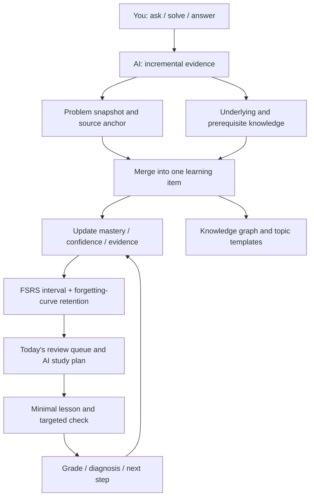

<p align="center">
  
</p>

<h1 align="center">LeetCode AI Helper 2.0</h1>

<p align="center"><strong>You focus on asking, solving, and answering. AI turns that work into the next learning step.</strong></p>

<p align="center">2.0 rewrites the whole client in SwiftUI as a native macOS app: the same learning engine, now in a native shell — with a draggable knowledge graph, tiered coding hints, and a model pipeline you can audit end to end.</p>

<p align="center">
  
  
  
  
  <a href="LICENSE"></a>
</p>

<p align="center">
  <a href="#about">About</a> ·
  <a href="#why-this-one">Why This One</a> ·
  <a href="#whats-new-in-20">What's New in 2.0</a> ·
  <a href="#showcase">Showcase</a> ·
  <a href="#core-capabilities">Core Capabilities</a> ·
  <a href="#how-it-works">How It Works</a> ·
  <a href="#quick-start">Quick Start</a> ·
  <a href="README.md">简体中文</a>
</p>

<p align="center">
  <a href="https://github.com/huaxx-lab/leetcode-ai-helper/stargazers">
    
  </a>
</p>

<p align="center"><strong>⭐ If it saved you a detour, leave a Star — that is the most direct fuel for keeping this project going.</strong></p>

---

| You focus on | AI handles automatically |
| --- | --- |
| Asking what you don't understand, writing and submitting code, answering review checks | Detecting learning gaps, merging duplicates, diagnosing failures, extracting prerequisites, recording evidence, updating mastery, scheduling review along the forgetting curve, distilling reusable templates, managing context |

<a id="about"></a>

## About

LeetCode AI Helper is not a chat wrapper that hands out answers. It is a personal algorithm-learning system for macOS that treats your questions, submissions, judge results, and review answers as a continuous stream of evidence, then runs the loop of *find the gap → extract the underlying concept → update the mastery judgement → schedule the next practice*.

What it deliberately refuses to do matters just as much: it never writes the full solution for you (coding hints point at direction and sticking points only), never counts "read the editorial" as mastery, and never overwrites past attempts. Every mastery judgement traces back to a specific question, submission, or review answer.

<a id="why-this-one"></a>

## Why This One

**Genuinely native macOS, not a wrapped web page.** Every screen in 2.0 is SwiftUI with Swift 6 strict concurrency. Windows, sidebar, tool column, scrolling, and glass materials are real native views, and startup is O(1): the first screen reads only the indexes it needs while vectors and long-term memory hydrate in the background. On the same learning data the native client launches faster, scrolls without dropped frames, and uses a fraction of the Electron build's memory — no Chromium resident just to study algorithms.

| | Typical AI practice tool | This project, 2.0 |
| --- | --- | --- |
| Form factor | Web app or wrapped client | Native macOS app (SwiftUI + Swift 6) |
| What you get | The answer, the editorial | Direction and sticking points; you still write the solution |
| Mastery | Streaks and problem counts | Evidence-driven, discounted by the forgetting curve |
| Review | Fixed reminders | FSRS interval + retention + weakness, reordered continuously |
| Notes | You maintain them | AI derives the knowledge tree; you add only your own notes and links |
| Models | Locked to one provider | Any compatible provider, six task classes routed separately |
| Cost | Opaque | Ledgered per provider, model, and task, exact and estimated apart |

**Every core capability serves one goal: make the next practice worth doing.**

- Submissions are attributed automatically — compile errors, failing cases, and source diffs are analyzed per attempt into "shore up / do next", never reusing an old conclusion;
- Knowledge grows into a tree — controlled knowledge paths derived from real problems, with the same concept merged across conversations instead of duplicated;
- Review queues itself — FSRS sets the interval, the forgetting curve says how much is left, and the more overdue and more forgotten items rise to the top;
- Hints stay in bounds — three tiers read your current code while the prompt and a deterministic post-check keep the full solution out;
- Context maintains itself — rolling summaries and token-budgeted packing, with live usage and distance-to-compaction on screen.

**Local first, with optional backends of your own.** All data lives on your machine by default. When you want to share it across machines, plug in your own backends: Redis as a hot cache for analyses, submission details, and usage counters; PostgreSQL + pgvector as the vector store for cross-conversation retrieval; Eclipse JDT LS for Java completion. All three are side paths — if any goes down the app falls back to the local path and keeps working. Deployment scripts ship with the repository; see [Optional Backends](#optional-backends).

<a id="whats-new-in-20"></a>

## What's New in 2.0

The centrepiece of 2.0 is the native macOS client under `native/` (SwiftUI, Swift 6 strict concurrency). The brains — learning engine, FSRS scheduling, LeetCode integration — carry over; the shell and the interaction model are new.

- **Native macOS client.** Every screen is SwiftUI. Windows, sidebar, and tool column are real native views; scrollbars, glass materials, and traffic-light alignment follow macOS rules instead of being simulated in a web page.
- **Knowledge graph, rebuilt.** A hand-rolled mind-map canvas (DOM cards + SVG wires + its own tidy layout) with collapsing, sibling reordering by drag, and pinch zoom. The detail card is a note you can drag around: click any passage to edit it in place, click elsewhere to save and render Markdown, and hold Shift while dragging from one card to another to create a link.
- **The forgetting curve, everywhere.** FSRS retrievability now lives on the native side, so mastery is discounted by *how much you still remember*. Today's review order, learning insights, graph nodes, and the AI study plan all read the same number — no more "this page says review it, that page says you're fine".
- **Tiered coding hints.** Hints escalate in three steps (direction → sticking point → next move). Every step reads your current code, while the prompt and a deterministic post-check keep the full solution out of the answer.
- **An auditable model pipeline.** Every real model call goes through task routing and a central ledger that tracks tokens and outcomes per provider, model, and task. A structured task is only recorded as successful once decoding, semantic validation, and local processing have all passed.
- **Built-in browser with one unified tab strip.** Tool tabs and web tabs share a single strip; tabs shrink as they multiply, and dragging one moves it under your cursor while the rest step aside.
- **Optional backends: Redis and pgvector.** Redis caches analyses, submission details, and usage counters; PostgreSQL + pgvector stores the 640-dimensional vectors used for cross-conversation retrieval, shared by every client you run. Both are deadline-bounded with a circuit breaker and fall back to local files.
- **Java completion.** Optional Eclipse JDT LS integration provides type, method, and API completion inside the native editor.

The 1.x Electron client remains in `src/` with its build and release scripts intact. Both share the same application-data directory.

<a id="showcase"></a>

## Showcase

### Knowledge graph: an AI-derived tree plus your own layer

<p align="center">
  
</p>

Knowledge paths are derived by AI from real problems; each node shows how many items sit under it and their average mastery (already discounted by the forgetting curve). The manual layer only adds what you wrote: notes, links, ordering, collapse state. Delete a concept and everything anchored to it is cleaned up — no wires pointing at nothing.

### Practice: statement, submission trail, and AI review

<p align="center">
  
</p>

Each submission is analyzed on its own, keyed by `submissionId`: compile errors, failing cases, passed counts, and source diffs feed that attempt's trail, which rolls up into "what to shore up" and "what to do next". A new attempt never reuses an old conclusion.

### Coding hints: direction, not answers

<p align="center">
  
</p>

Three levels, unlocked one at a time: the idea and a self-check list first, then where you are stuck, and only then what to do next. Hints render Markdown and scale with the system text size.

### Java completion in the editor

<p align="center">
  
</p>

### Study plan: AI picks what, the app decides when

<p align="center">
  
</p>

The model only returns an ordering and the reasoning behind it. The local scheduler decides the actual day and time from your daily quota, time budget, and occupied slots. Overdue items come first; among equally overdue ones, the one you have forgotten more wins.

### Conversation and the built-in browser

<p align="center">
  
</p>

Code blocks in conversations, editorials, statements, notes, and diagnostics all share one renderer (markdown-it + highlight.js + DOMPurify), and copying always goes through the native pasteboard. The tool column on the right is a real multi-tab browser where sources, evidence, preview, and web pages sit on the same strip.

### Providers and task routing

<p align="center">
  
</p>

DeepSeek, Alibaba Cloud, and OpenCode Go ship built in, and any compatible provider can be added. Each task class — main conversation, titles and summaries, study plan, submission analysis, cross-conversation memory, coding hints — can point at its own provider and model. API keys live in the system keychain; the UI only ever shows whether one is configured.

<a id="core-capabilities"></a>

## Core Capabilities

- **The whole learning loop is automated.** You ask, solve, submit, and take review checks. Gap detection, deduplication, failure analysis, classification, mastery updates, review ordering, template distillation, and progress tracking happen behind the scenes.
- **Questions are distilled, not "bookmarked".** Only unprocessed messages and new submissions are analyzed. Running into the same problem in another conversation merges into the original item through a stable `canonicalKey`, so evidence accumulates instead of duplicating.
- **Concepts are extracted from problems.** A concrete problem is decomposed into algorithmic patterns, data structures, language mechanics, or common APIs, using a controlled knowledge path so the model cannot invent a new taxonomy on every run.
- **Mastery is judged from evidence.** Gaps exposed by questions, repeated blocks, independent application, correct explanations, judge results, and review answers all become confidence-weighted signals — and later performance can overturn an earlier judgement.
- **Review is driven by weakness and by memory.** FSRS sets the interval, the forgetting curve says how much is left today, and mastery, confidence, and overdue days settle today's ordering.
- **Review must produce new evidence.** A short lesson plus a multiple-choice, short-answer, code-completion, or coding check targets the smallest current gap; the grade feeds straight back into mastery and the next due date.
- **Knowledge settles into reusable methods.** Once a topic has enough problems, the app distills when it applies, the steps, the common mistakes, and a compilable skeleton — not one problem's answer.
- **Context is managed for you.** Live usage, input estimate, remaining budget, and the compaction threshold are always visible; long conversations get a rolling summary that keeps the current problem and key conclusions.
- **Model usage is transparent.** Input, output, cached, and reasoning tokens plus tool calls are tracked per conversation, task, provider, and model — with exact and estimated usage kept apart.
- **Local first, backends optional.** Everything stays on your machine unless you add Redis and pgvector for multi-machine use — and even then availability never depends on the server.

<a id="how-it-works"></a>

## How It Works

You produce real learning behaviour; the app organizes the follow-up around that evidence. Raw questions and judge results say what happened, AI structures and attributes it, and the scheduler decides what comes next.



Three rules hold throughout: a model answer is not evidence of learning; reading an editorial is not mastery; attempts are appended, never overwritten.

## Security

- The repository contains no API keys, account cookies, SSH private keys, or server addresses.
- The native client stores provider keys in the system keychain; the Electron client encrypts them with `safeStorage`. Neither echoes a stored key back to the UI.
- To generate answers, summaries, and submission analysis, problems, questions, and related code are sent to the provider you choose. Pick models and accounts according to that provider's privacy policy.
- Conversations, learning items, and analyses are stored as JSON in the local application-data directory without encryption at rest. Protect your account and disk, and review content before sharing logs or backups.
- LeetCode and Bilibili sessions live in the app's isolated web session and never touch the repository.
- Remote Java completion is off by default and must be enabled through local environment variables.
- `.env.local`, build output, dependency directories, debug captures, and key files are all covered by `.gitignore`.

See [SECURITY.md](SECURITY.md) for details.

<a id="quick-start"></a>

## Quick Start

### Requirements

- Native client: macOS 15+, Xcode 26 (Swift 6 toolchain), Apple Silicon;
- Electron client: macOS 13+, Node.js 22, Xcode Command Line Tools, Python 3 for `node-gyp`;
- An API key for a supported AI provider.

### Build and run the native client (2.0)

```bash
git clone https://github.com/huaxx-lab/leetcode-ai-helper.git
cd leetcode-ai-helper/native
swift build            # requires the Swift 6 toolchain from Xcode 26
swift test
./scripts/build-preview-app.sh
```

The script generates the icon, builds, strips extended attributes, and signs locally. Output:

```text
native/.build/LeetCode AI 助手 Preview.app
```

If the repository lives in an iCloud/File Provider directory, codesigning the resource bundle can fail because of extended attributes. Build somewhere else:

```bash
swift build --scratch-path /tmp/leetcode-native-build
```

### Build and run the Electron client (1.x)

```bash
npm install
npm start              # or ./start.sh
npm run install:mac    # build and install into /Applications
```

### First run

1. Open Settings → Model Providers and pick DeepSeek, Alibaba Cloud, OpenCode Go, or add your own.
2. Fill in the API base URL, key, and model, refresh the model list, and save. Route individual tasks to other providers if you want.
3. Sign in to LeetCode China in the built-in browser.
4. Import a problem list or sync submissions, then run, submit, and read the AI analysis in the problem workspace.

Application data lives in:

```text
~/Library/Application Support/leetcode-ai-helper/
```

Deleting the repository or rebuilding does not remove it. Strip accounts, code, problem history, and credentials before attaching logs to an issue.

<a id="optional-backends"></a>

## Optional Backends

All three services are optional: without them the app still runs (analyses and vectors live in local files, Java falls back to local syntax checking and basic completion). With them, every client you run shares one cache and one vector store. Deployment lives in [`scripts/remote-services`](scripts/remote-services) and [`scripts/remote-lsp`](scripts/remote-lsp).

| Service | Role | When unavailable |
| --- | --- | --- |
| Redis | Hot cache for analyses, submission details, usage counters, shared by both clients | Deadline-bounded calls, circuit breaker trips, falls back to local files |
| PostgreSQL + pgvector | 640-dimensional vector store for cross-conversation retrieval | Layer suspends for two minutes, retrieval falls back to the local cache |
| Eclipse JDT LS | Java completion | Falls back to local syntax checking and basic completion |

All three listen on `127.0.0.1` only and are reached through an SSH local port forward. **Never open 6379 / 5432 / 9092 in a firewall.**

### Redis and pgvector

```bash
scp -r scripts/remote-services ubuntu@example.com:/tmp/leetcode-services
ssh ubuntu@example.com
cd /tmp/leetcode-services
cp .env.example .env && $EDITOR .env && chmod 600 .env
docker compose up -d
```

Open the tunnel on the client, then fill in the addresses, accounts, and passwords under Settings → Data & Cache and test the connection (passwords go to the system keychain):

```bash
ssh -f -N -L 6379:127.0.0.1:6379 -L 5432:127.0.0.1:5432 ubuntu@example.com
```

The app creates the vector table itself; `init-pgvector.sql` just makes the first deployment complete and adds the nearest-neighbour index.

### Java completion service

```bash
scp -r scripts/remote-lsp ubuntu@example.com:/tmp/leetcode-lsp
ssh ubuntu@example.com
cd /tmp/leetcode-lsp
sudo bash install.sh
curl http://127.0.0.1:9092/health
```

Client settings go into `.env.local` (never tracked by Git — and never put private key material in it):

```dotenv
LEETCODE_LSP_SSH_HOST=example.com
LEETCODE_LSP_SSH_USER=ubuntu
LEETCODE_LSP_SSH_PORT=22
LEETCODE_LSP_TARGET_PORT=9092
LEETCODE_LSP_SSH_IDENTITY_FILE=/absolute/path/to/ssh_private_key
```

## Common Commands

| Command | Purpose |
| --- | --- |
| `cd native && swift build` | Build the native client |
| `cd native && swift test` | Native regression tests (XCTest + Swift Testing) |
| `native/scripts/build-preview-app.sh` | Produce a runnable `.app` |
| `npm start` / `./start.sh` | Run the Electron client |
| `npm test` | Electron regression tests |
| `npm run package:mac` | Build the Electron `.app`, zip, and DMG |
| `npm run install:mac` | Build and install the Electron client into `/Applications` |

## Project Layout

```text
native/Sources/             Native client: views, models, services, bundled resources
native/Tests/               Native regression tests
native/scripts/             Icon generation and preview-app build scripts
src/main/                   Electron lifecycle, IPC, and the secure preload bridge
src/renderer/               Electron UI, interaction state, and styling
src/core/                   Learning engine, knowledge merging, code checks, content processing
src/integrations/           LeetCode, video, provider, and streaming-protocol adapters
src/platform/               macOS window layout, display configuration, media cache
assets/                     App and provider icons
scripts/remote-services/    Optional backends: Redis + pgvector compose file and init SQL
scripts/remote-lsp/         Optional backend: Eclipse JDT LS installer and systemd unit
scripts/                    Build, signing, and install scripts
test/                       Regression and security tests with no account data
docs/screenshots/           Real product screenshots used by the README (1.x archived in legacy-electron/)
docs/ui-optimization/       Design and rework notes per screen
```

## Contributing

Read the [contribution guide](CONTRIBUTING.md) and run both test suites before submitting. Never commit real API keys, cookies, server addresses, private keys, application data, or build output. Licensed under [MIT](LICENSE).

> LeetCode is a trademark of its respective owner. This is an independent open-source tool with no affiliation with or endorsement by LeetCode.
