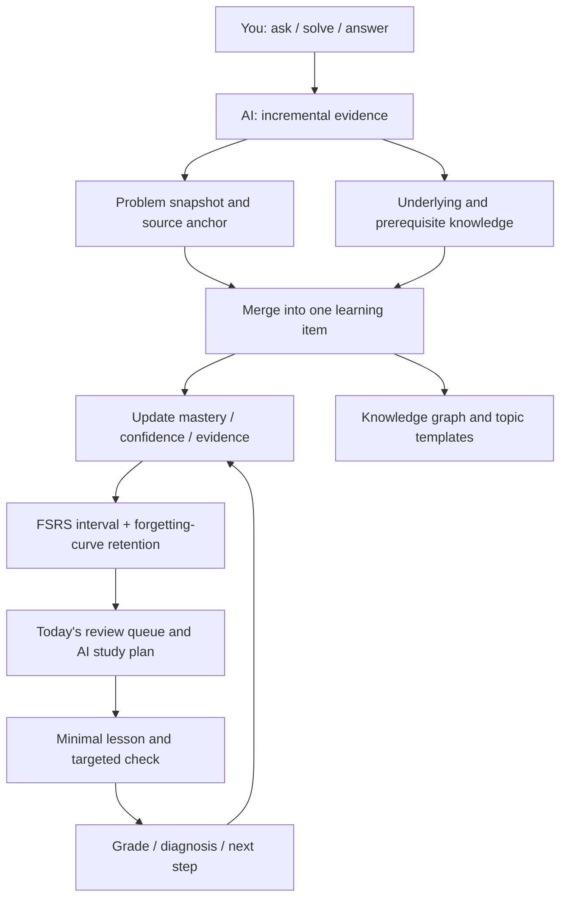

<p align="center">
  
</p>

<h1 align="center">LeetCode AI Helper 2.0</h1>

<p align="center"><strong>You focus on asking, solving, and answering. AI turns that work into the next learning step.</strong></p>

<p align="center">2.0 rewrites the whole client in SwiftUI as a native macOS app: the same learning engine, now in a native shell — with a draggable knowledge graph, tiered coding hints, and a model pipeline you can audit end to end.</p>

<p align="center">
  
  
  
  
  <a href="LICENSE"></a>
</p>

<p align="center">
  <a href="#about">About</a> ·
  <a href="#why-this-one">Why This One</a> ·
  <a href="#highlights">Highlights</a> ·
  <a href="#showcase">Showcase</a> ·
  <a href="#core-capabilities">Core Capabilities</a> ·
  <a href="#how-it-works">How It Works</a> ·
  <a href="#quick-start">Quick Start</a> ·
  <a href="README.md">简体中文</a>
</p>

<p align="center">
  <a href="https://github.com/huaxx-lab/leetcode-ai-helper/stargazers">
    
  </a>
</p>

<p align="center"><strong>⭐ If it saved you a detour, leave a Star — that is the most direct fuel for keeping this project going.</strong></p>

---

| You focus on | AI handles automatically |
| --- | --- |
| Asking what you don't understand, writing and submitting code, answering review checks | Detecting learning gaps, merging duplicates, diagnosing failures, extracting prerequisites, recording evidence, updating mastery, scheduling review along the forgetting curve, distilling reusable templates, managing context |

<a id="about"></a>

## About

LeetCode AI Helper is not a chat wrapper that hands out answers. It is a personal algorithm-learning system for macOS that treats your questions, submissions, judge results, and review answers as a continuous stream of evidence, then runs the loop of *find the gap → extract the underlying concept → update the mastery judgement → schedule the next practice*.

What it deliberately refuses to do matters just as much: it never writes the full solution for you (coding hints point at direction and sticking points only), never counts "read the editorial" as mastery, and never overwrites past attempts. Every mastery judgement traces back to a specific question, submission, or review answer.

<a id="why-this-one"></a>

## Why This One

**Genuinely native macOS, not a wrapped web page.** Every screen in 2.0 is SwiftUI with Swift 6 strict concurrency. Windows, sidebar, tool column, scrolling, and glass materials are real native views, and startup is O(1): the first screen reads only the indexes it needs while vectors and long-term memory hydrate in the background. On the same learning data the native client launches faster, scrolls without dropped frames, and uses a fraction of the Electron build's memory — no Chromium resident just to study algorithms.

| | Typical AI practice tool | This project, 2.0 |
| --- | --- | --- |
| Form factor | Web app or wrapped client | Native macOS app (SwiftUI + Swift 6) |
| What you get | The answer, the editorial | Direction and sticking points; you still write the solution |
| Mastery | Streaks and problem counts | Evidence-driven, discounted by the forgetting curve |
| Review | Fixed reminders | FSRS interval + retention + weakness, reordered continuously |
| Notes | You maintain them | AI derives the knowledge tree; you add only your own notes and links |
| Models | Locked to one provider | Any compatible provider, six task classes routed separately |
| Cost | Opaque | Ledgered per provider, model, and task, exact and estimated apart |

**Local first, with optional backends of your own.** All data lives on your machine by default. When you want to share it across machines, plug in your own backends: Redis as a hot cache for analyses, submission details, and usage counters; PostgreSQL + pgvector as the vector store for cross-conversation retrieval; Eclipse JDT LS for Java completion. All three are side paths — if any goes down the app falls back to the local path and keeps working. Deployment scripts ship with the repository; see [Optional Backends](#optional-backends).

<a id="highlights"></a>

## Highlights

<table>
<tr>
<td width="33%" valign="top">

### 🖥 Genuinely native

SwiftUI + Swift 6 across every screen, O(1) cold start, no dropped frames — and no resident Chromium just to study algorithms.

</td>
<td width="33%" valign="top">

### 🧠 Mastery that fades

FSRS retention runs through review, insights, the graph, and the plan — "learned once" and "still know it" are not the same number.

</td>
<td width="33%" valign="top">

### 💡 Direction only

Three hint tiers read your current code and point the way; a deterministic check strips anything resembling a full solution.

</td>
</tr>
<tr>
<td valign="top">

### 🗺 A graph that grows

AI derives the knowledge tree from real problems; you only add notes and links. Click a passage to edit it, click away to save.

</td>
<td valign="top">

### 🧾 Every token accounted for

Ledgered per provider, model, and task, with exact and estimated usage apart — and six task classes routable to different models.

</td>
<td valign="top">

### 🗄 Local first, backends optional

Data stays on your machine; add Redis and pgvector for multi-machine use, and lose nothing when they go down.

</td>
</tr>
</table>

<a id="showcase"></a>

## Showcase

### Knowledge graph

AI derives the knowledge tree from real problems; each node shows how many items sit under it and their average mastery (already discounted by the forgetting curve). The manual layer only adds what you wrote — notes, links, ordering, collapse state. Delete a concept and everything anchored to it is cleaned up, with no wires pointing at nothing.

<p align="center">
  
</p>

### The practice loop

<table>
<tr>
<td width="50%" align="center"><br><sub><b>Statement + submission trail</b>: every attempt analyzed on its own <code>submissionId</code>, rolled up into "shore up / do next"</sub></td>
<td width="50%" align="center"><br><sub><b>Tiered hints</b>: direction → sticking point → next move; reads your code without writing it</sub></td>
</tr>
<tr>
<td width="50%" align="center"><br><sub><b>Native editor</b>: syntax checking and formatting, with optional Eclipse JDT LS for type and API completion</sub></td>
<td width="50%" align="center"><br><sub><b>Study plan</b>: the model picks what, the local scheduler picks when from your quota and time budget</sub></td>
</tr>
</table>

### Conversation, browser, and models

<table>
<tr>
<td width="50%" align="center"><br><sub><b>One code renderer</b>: conversations, editorials, statements, and notes share highlighting and copying; the right column is a real multi-tab browser</sub></td>
<td width="50%" align="center"><br><sub><b>Any provider</b>: six task classes routed separately, API keys in the system keychain, never echoed back</sub></td>
</tr>
</table>

<a id="core-capabilities"></a>

## Core Capabilities

### The learning loop: evidence in, next step out

| Capability | What it actually does |
| --- | --- |
| **Incremental evidence** | Only unprocessed messages and new submissions are analyzed — the same context is never burned twice |
| **Cross-conversation merging** | The same concept merges under a stable `canonicalKey`, accumulating evidence instead of duplicate cards |
| **Concept extraction** | A problem is decomposed into algorithmic patterns, data structures, language mechanics, or APIs from a controlled vocabulary |
| **Mastery and confidence** | Every signal carries a confidence; later performance can overturn an earlier judgement |
| **Forgetting-curve discount** | FSRS retention decides what is left today, and the whole app reads that one number |
| **Today's review** | Queued by quota, overdue first and most-forgotten ahead of it, with manual grading written back |
| **Review checks** | Multiple-choice, short answer, code completion, or a coding task aimed at the smallest gap; the grade updates mastery and the next due date |
| **Algorithm templates** | Once a topic has enough problems, its applicability, steps, pitfalls, and a compilable skeleton are distilled |
| **Learning insights** | Topic distribution, weak areas, due forecast, mastery trend |
| **Trash** | Deleted learning items can be recovered — a misclick is not permanent |

### LeetCode integration: statement to verdict, in-app

| Capability | What it actually does |
| --- | --- |
| **Built-in sign-in** | LeetCode China runs in the app's isolated session; WeChat / QQ / GitHub popup sign-in all work |
| **Lists and sync** | Import lists such as Hot 100, fetch submissions directly by `titleSlug`, and sync incrementally |
| **Native statement** | Statement, examples, constraints, and hints render natively, sharing the app's code highlighting |
| **Run and submit** | Run samples and submit to the judge; results are polled and parsed into compile errors, failing cases, passed counts, runtime and memory |
| **Submission trail** | Each attempt is attributed on its own into "shore up / do next"; history is appended, never overwritten |
| **Editorials online** | Official and community editorials are readable in-app, multi-image posts collapse into a carousel, editorial videos play in place |
| **Problem action bar** | Upvote, discuss, favourite, share, official hints, and the live solver count |
| **Prev / next problem** | Work through a list without going back to the index |
| **Activity heatmap** | Submission heatmap, streaks, weekly rhythm, and difficulty breakdown |

### Conversation and context

| Capability | What it actually does |
| --- | --- |
| **Streaming answers** | Rendered as they arrive and interruptible; reasoning effort selectable from off to maximum |
| **Context budget** | Live usage, input estimate, remaining budget, and how many tokens until compaction |
| **Rolling summary** | Summaries pre-warm near the limit, keeping system instructions, the current problem, and key conclusions |
| **Question navigation** | Jump between questions in long threads, long prompts collapse, one click back to the bottom |
| **Cross-conversation memory** | Off / index / retrieve tiers, with fact extraction plus vector search |
| **Image input** | HTTPS only, deduplicated and capped, attached only for models that actually support vision |

### Built-in browser and tool column

| Capability | What it actually does |
| --- | --- |
| **Real tabs** | Tool tabs and web tabs share one strip, shrink as they multiply, and follow the cursor when dragged |
| **Session restore** | Reopen and your tabs are still there — switchable in settings |
| **History and downloads** | Browsing history is inspectable and clearable; downloads can ask where to save |
| **Popup bridge** | `window.open` and `target=_blank` work, so OAuth sign-in never blows away the page you were on |
| **Media lifecycle** | Switching tabs pauses playback instead of letting background tabs hog resources |
| **Link destination** | Links in conversations, editorials, and sources can open in-app or in the system browser |
| **Bilibili video** | The video entry appears only when AI decides the topic is a LeetCode problem or worth studying properly |

### Models and usage

| Capability | What it actually does |
| --- | --- |
| **Any provider** | DeepSeek, Alibaba Cloud, and OpenCode Go built in, plus any compatible endpoint and custom model names |
| **Ten task routes** | Conversation, titles, video matching, evidence analysis, study plan, lessons and checks, grading, submission analysis, memory, coding hints — each routable |
| **Central ledger** | Input, output, cached, and reasoning tokens plus tool calls per conversation, task, provider, and model |
| **Exact vs estimated** | Only provider-reported usage counts as exact; the rest is labelled estimated instead of blended together |
| **Failures counted too** | A structured task is successful only after decoding, semantic validation, and local processing all pass |
| **Key safety** | API keys live in the system keychain, the UI shows only "configured", and provider URLs pass an HTTPS policy check |

### Interface and engineering

| Capability | What it actually does |
| --- | --- |
| **Liquid glass** | Cards, capsules, and popovers share one glass material over a gradient backdrop that gives it something to refract |
| **Hand-drawn overlay scrollbars** | One implementation everywhere: fades in on scroll, out at rest, and never steals layout width |
| **Motion with a reason** | Selection, panel, and fade timings are separate; drags are tweened so wires and cards move in the same frame |
| **Window behaviour** | Always-on-top, full screen, cross-display position memory, single-instance guard |
| **Appearance** | System / light / dark, with text scaling with the system size |
| **Regression tests** | 216 XCTest + 100 Swift Testing on the native side, 103 on the Electron side, green before release |

<a id="how-it-works"></a>

## How It Works

You produce real learning behaviour; the app organizes the follow-up around that evidence. Raw questions and judge results say what happened, AI structures and attributes it, and the scheduler decides what comes next.



Three rules hold throughout: a model answer is not evidence of learning; reading an editorial is not mastery; attempts are appended, never overwritten.

## Security

- The repository contains no API keys, account cookies, SSH private keys, or server addresses.
- The native client stores provider keys in the system keychain; the Electron client encrypts them with `safeStorage`. Neither echoes a stored key back to the UI.
- To generate answers, summaries, and submission analysis, problems, questions, and related code are sent to the provider you choose. Pick models and accounts according to that provider's privacy policy.
- Conversations, learning items, and analyses are stored as JSON in the local application-data directory without encryption at rest. Protect your account and disk, and review content before sharing logs or backups.
- LeetCode and Bilibili sessions live in the app's isolated web session and never touch the repository.
- Remote Java completion is off by default and must be enabled through local environment variables.
- `.env.local`, build output, dependency directories, debug captures, and key files are all covered by `.gitignore`.

See [SECURITY.md](SECURITY.md) for details.

<a id="quick-start"></a>

## Quick Start

### Requirements

- Native client: macOS 15+, Xcode 26 (Swift 6 toolchain), Apple Silicon;
- Electron client: macOS 13+, Node.js 22, Xcode Command Line Tools, Python 3 for `node-gyp`;
- An API key for a supported AI provider.

### Build and run the native client (2.0)

```bash
git clone https://github.com/huaxx-lab/leetcode-ai-helper.git
cd leetcode-ai-helper/native
swift build            # requires the Swift 6 toolchain from Xcode 26
swift test
./scripts/build-preview-app.sh
```

The script generates the icon, builds, strips extended attributes, and signs locally. Output:

```text
native/.build/LeetCode AI 助手 Preview.app
```

If the repository lives in an iCloud/File Provider directory, codesigning the resource bundle can fail because of extended attributes. Build somewhere else:

```bash
swift build --scratch-path /tmp/leetcode-native-build
```

### Build and run the Electron client (1.x)

```bash
npm install
npm start              # or ./start.sh
npm run install:mac    # build and install into /Applications
```

### First run

1. Open Settings → Model Providers and pick DeepSeek, Alibaba Cloud, OpenCode Go, or add your own.
2. Fill in the API base URL, key, and model, refresh the model list, and save. Route individual tasks to other providers if you want.
3. Sign in to LeetCode China in the built-in browser.
4. Import a problem list or sync submissions, then run, submit, and read the AI analysis in the problem workspace.

Application data lives in:

```text
~/Library/Application Support/leetcode-ai-helper/
```

Deleting the repository or rebuilding does not remove it. Strip accounts, code, problem history, and credentials before attaching logs to an issue.

<a id="optional-backends"></a>

## Optional Backends

All three services are optional: without them the app still runs (analyses and vectors live in local files, Java falls back to local syntax checking and basic completion). With them, every client you run shares one cache and one vector store. Deployment lives in [`scripts/remote-services`](scripts/remote-services) and [`scripts/remote-lsp`](scripts/remote-lsp).

| Service | Role | When unavailable |
| --- | --- | --- |
| Redis | Hot cache for analyses, submission details, usage counters, shared by both clients | Deadline-bounded calls, circuit breaker trips, falls back to local files |
| PostgreSQL + pgvector | 640-dimensional vector store for cross-conversation retrieval | Layer suspends for two minutes, retrieval falls back to the local cache |
| Eclipse JDT LS | Java completion | Falls back to local syntax checking and basic completion |

All three listen on `127.0.0.1` only and are reached through an SSH local port forward. **Never open 6379 / 5432 / 9092 in a firewall.**

### Redis and pgvector

```bash
scp -r scripts/remote-services ubuntu@example.com:/tmp/leetcode-services
ssh ubuntu@example.com
cd /tmp/leetcode-services
cp .env.example .env && $EDITOR .env && chmod 600 .env
docker compose up -d
```

Open the tunnel on the client, then fill in the addresses, accounts, and passwords under Settings → Data & Cache and test the connection (passwords go to the system keychain):

```bash
ssh -f -N -L 6379:127.0.0.1:6379 -L 5432:127.0.0.1:5432 ubuntu@example.com
```

The app creates the vector table itself; `init-pgvector.sql` just makes the first deployment complete and adds the nearest-neighbour index.

### Java completion service

```bash
scp -r scripts/remote-lsp ubuntu@example.com:/tmp/leetcode-lsp
ssh ubuntu@example.com
cd /tmp/leetcode-lsp
sudo bash install.sh
curl http://127.0.0.1:9092/health
```

Client settings go into `.env.local` (never tracked by Git — and never put private key material in it):

```dotenv
LEETCODE_LSP_SSH_HOST=example.com
LEETCODE_LSP_SSH_USER=ubuntu
LEETCODE_LSP_SSH_PORT=22
LEETCODE_LSP_TARGET_PORT=9092
LEETCODE_LSP_SSH_IDENTITY_FILE=/absolute/path/to/ssh_private_key
```

## Common Commands

| Command | Purpose |
| --- | --- |
| `cd native && swift build` | Build the native client |
| `cd native && swift test` | Native regression tests (XCTest + Swift Testing) |
| `native/scripts/build-preview-app.sh` | Produce a runnable `.app` |
| `npm start` / `./start.sh` | Run the Electron client |
| `npm test` | Electron regression tests |
| `npm run package:mac` | Build the Electron `.app`, zip, and DMG |
| `npm run install:mac` | Build and install the Electron client into `/Applications` |

## Project Layout

```text
native/Sources/             Native client: views, models, services, bundled resources
native/Tests/               Native regression tests
native/scripts/             Icon generation and preview-app build scripts
src/main/                   Electron lifecycle, IPC, and the secure preload bridge
src/renderer/               Electron UI, interaction state, and styling
src/core/                   Learning engine, knowledge merging, code checks, content processing
src/integrations/           LeetCode, video, provider, and streaming-protocol adapters
src/platform/               macOS window layout, display configuration, media cache
assets/                     App and provider icons
scripts/remote-services/    Optional backends: Redis + pgvector compose file and init SQL
scripts/remote-lsp/         Optional backend: Eclipse JDT LS installer and systemd unit
scripts/                    Build, signing, and install scripts
test/                       Regression and security tests with no account data
docs/screenshots/           Real product screenshots used by the README (1.x archived in legacy-electron/)
docs/ui-optimization/       Design and rework notes per screen
```

## Contributing

Read the [contribution guide](CONTRIBUTING.md) and run both test suites before submitting. Never commit real API keys, cookies, server addresses, private keys, application data, or build output. Licensed under [MIT](LICENSE).

> LeetCode is a trademark of its respective owner. This is an independent open-source tool with no affiliation with or endorsement by LeetCode.
