<p align="center">
  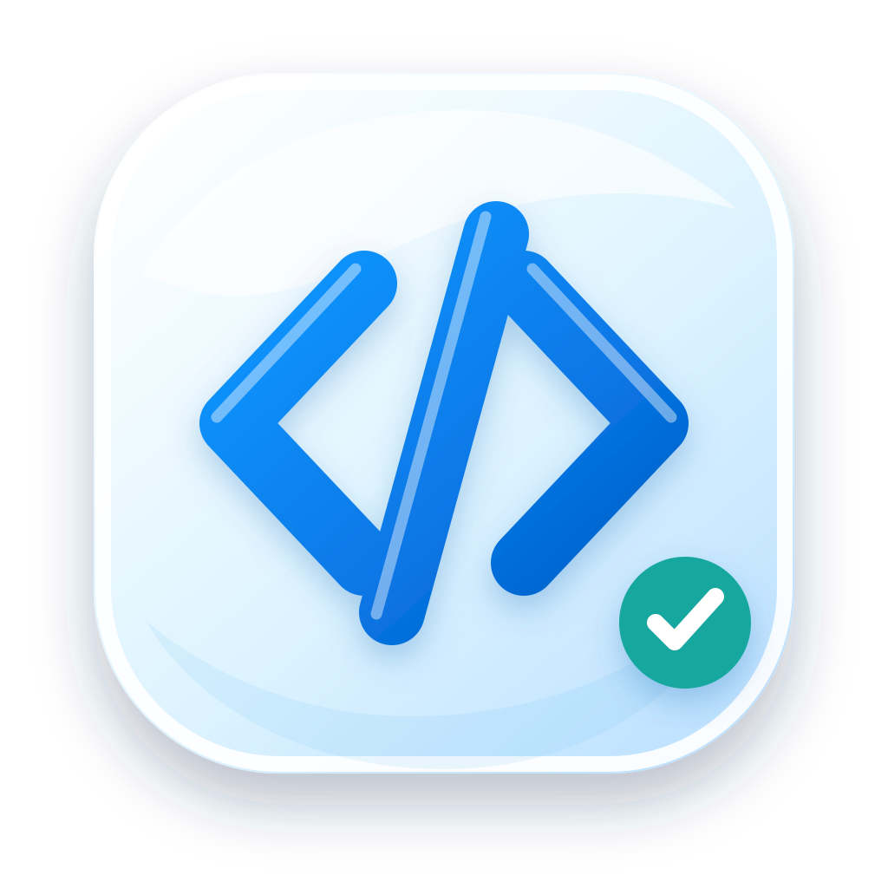
</p>

<h1 align="center">LeetCode AI Helper</h1>

<p align="center"><strong>You focus on asking, solving, and answering. AI turns that work into the next learning step.</strong></p>

<p align="center">No manual notes, tagging, or review calendars. AI continuously summarizes questions, analyzes each submission, extracts underlying knowledge, updates mastery, and schedules review while you keep learning.</p>

<p align="center">
  
  
  
  
  <a href="LICENSE"></a>
</p>

<p align="center">
  <a href="#about">About</a> ·
  <a href="#showcase">Showcase</a> ·
  <a href="#core-capabilities">Core Capabilities</a> ·
  <a href="#context-architecture">Context Architecture</a> ·
  <a href="#how-it-works">How It Works</a> ·
  <a href="#quick-start">Quick Start</a> ·
  <a href="README.md">简体中文</a>
</p>

---

| You focus on | AI handles automatically |
| --- | --- |
| Asking about gaps, writing and submitting code, and completing review assessments | Detecting learning topics, merging duplicates, diagnosing errors, extracting prerequisites, recording evidence, updating mastery, scheduling reviews, deriving topic templates, managing context, and summarizing progress |

<a id="about"></a>

## About

LeetCode AI Helper is not an answer-generating chat wrapper. It is a personal algorithm learning system for macOS that treats questions, code submissions, judge results, and review answers as a continuous stream of learning evidence. AI handles the follow-up work: identifying a gap, extracting the underlying concept, updating mastery, and selecting the next useful exercise.

It addresses three problems that compound over long-term practice: knowledge disappearing when an AI conversation ends, recurring mistakes never becoming a coherent history, and review plans requiring too much manual upkeep. The goal is not to solve problems on your behalf, but to turn each authentic attempt into an auditable, reviewable ability record that changes with later performance.

The project is intended for people who already learn with AI but do not want to maintain chat archives, mistake notebooks, taxonomies, and review calendars by hand. Model providers and supporting services remain replaceable while the application owns the learning record and scheduling logic.

<a id="showcase"></a>

## Product Showcase

### Submission History and AI Review

Every attempt keeps its own conclusion. Real judge feedback, source changes, and performance data explain why that attempt failed, what changed, and what deserves attention next.

<p align="center">
  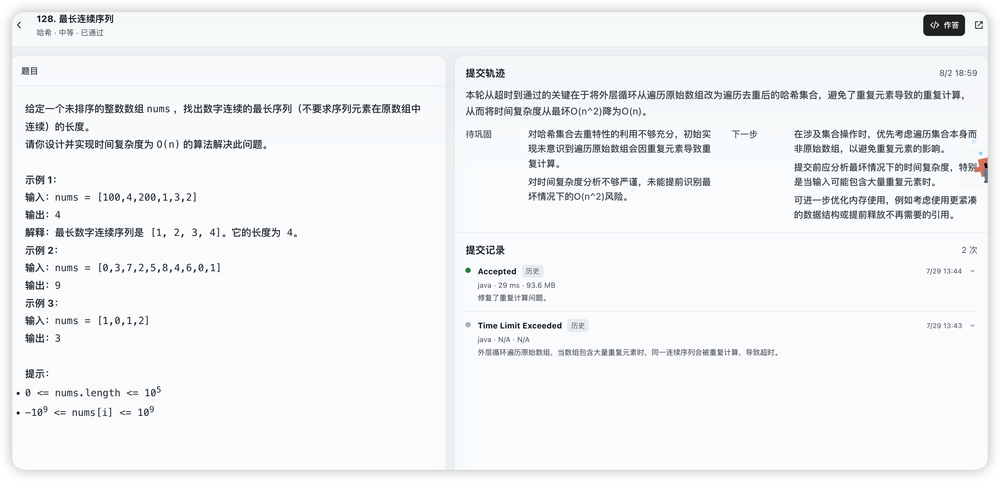
</p>

<table>
  <tr>
    <td width="50%" align="center">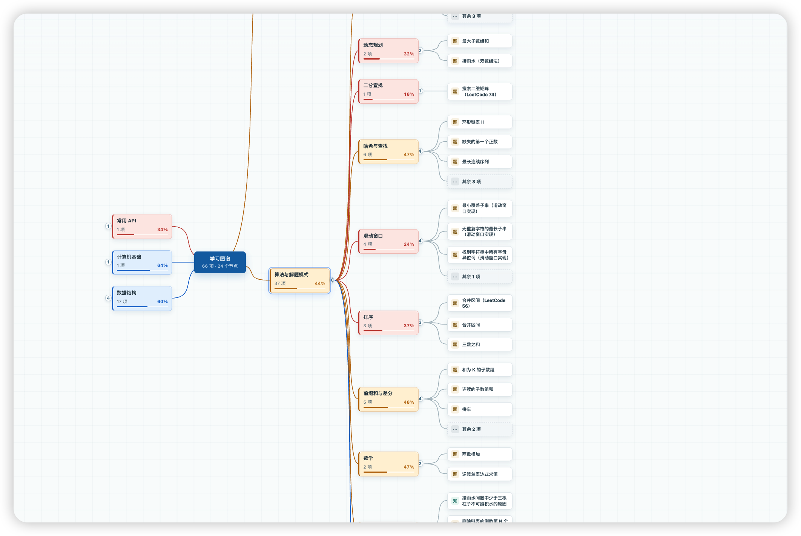</td>
    <td width="50%" align="center">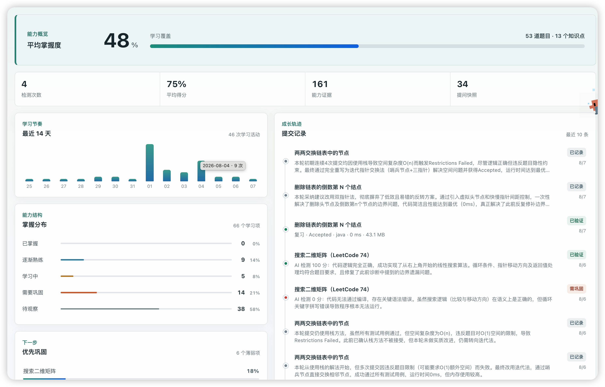</td>
  </tr>
  <tr>
    <td align="center"><strong>Knowledge map</strong><br>Organize problems into stable paths and inspect topic coverage, weak branches, and related items.</td>
    <td align="center"><strong>Learning insights</strong><br>Track actual progress through mastery, evidence volume, study rhythm, and growth history.</td>
  </tr>
  <tr>
    <td width="50%" align="center">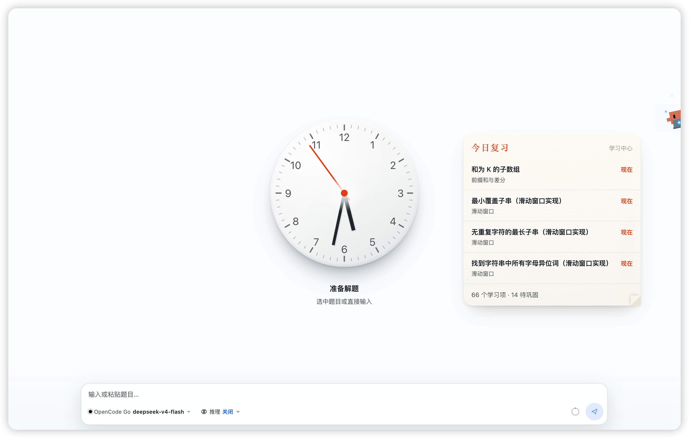</td>
    <td width="50%" align="center"></td>
  </tr>
  <tr>
    <td align="center"><strong>Today's review</strong><br>Build a daily queue from due and weak items, then cycle through practice, feedback, and reassessment.</td>
    <td align="center"><strong>AI providers</strong><br>Use DeepSeek, Alibaba Cloud, OpenCode Go, or another compatible endpoint.</td>
  </tr>
</table>

### From One Attempt to Long-Term Ability

Practice is the input; organization happens automatically afterward. AI turns real judge results into submission evidence, deposits exposed gaps into learning items, and derives reusable templates across related problems. No manual content transfer between screens is required.

<table>
  <tr>
    <td width="50%" align="center">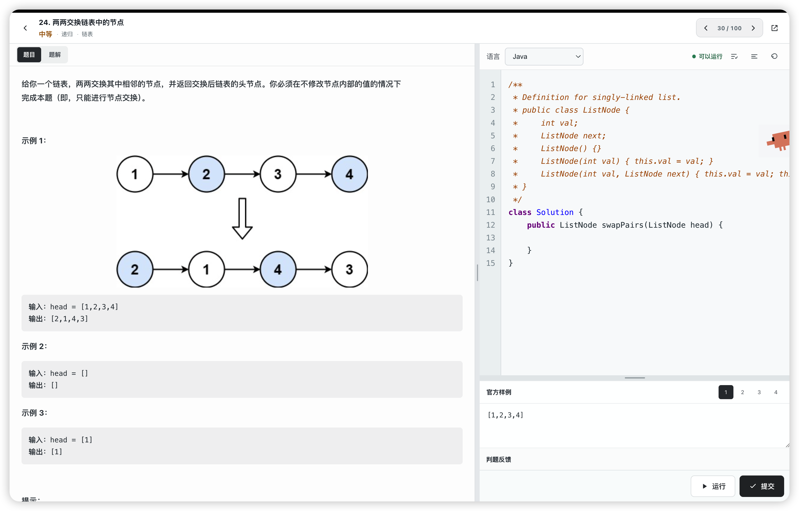</td>
    <td width="50%" align="center">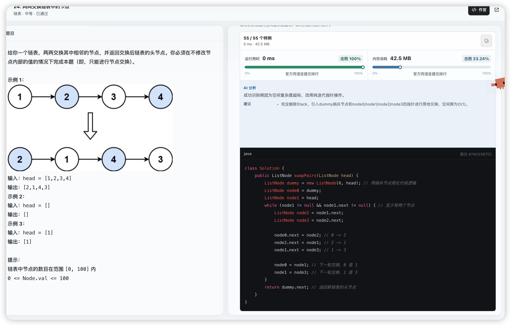</td>
  </tr>
  <tr>
    <td align="center"><strong>Focus on solving</strong><br>The problem, editor, cases, and live judge stay in one workspace. You only need to think and submit.</td>
    <td align="center"><strong>Automatic AI review</strong><br>Pass counts, performance, code, and constraints produce a distinct diagnosis and actionable improvement.</td>
  </tr>
  <tr>
    <td width="50%" align="center">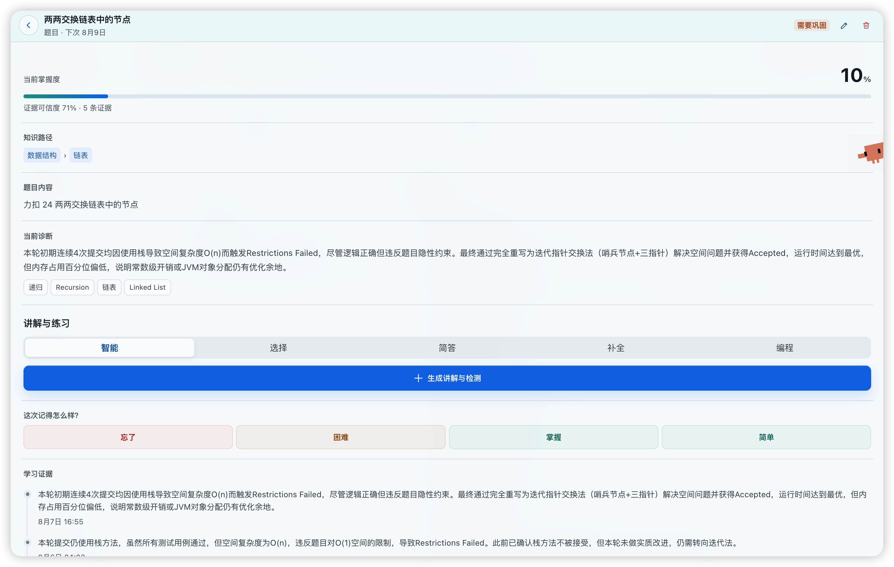</td>
    <td width="50%" align="center">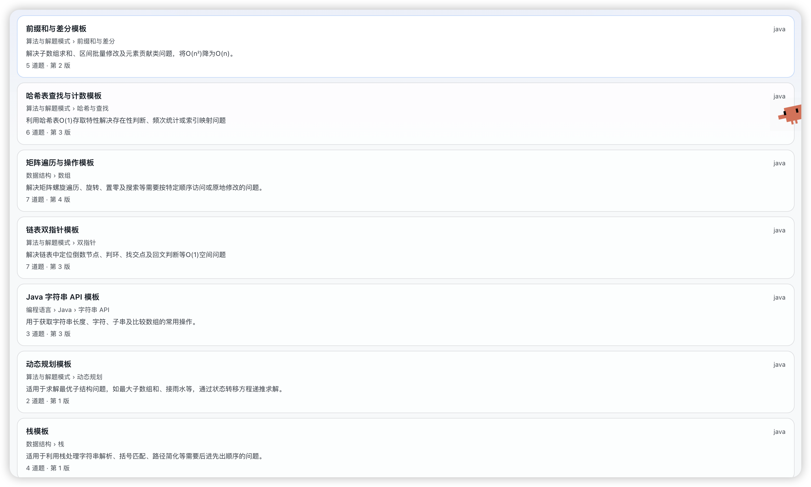</td>
  </tr>
  <tr>
    <td align="center"><strong>AI maintains the learning record</strong><br>Knowledge path, diagnosis, mastery, evidence confidence, and next review date stay current automatically.</td>
    <td align="center"><strong>AI distills reusable methods</strong><br>Related problems become recognition cues, steps, concrete pitfalls, and reusable code skeletons.</td>
  </tr>
</table>

### Automatic Conversation, Video, and Context Management

You can keep asking about the same problem without manually rebuilding context. The application exposes context usage, remaining budget, message count, and distance to automatic compression. Near the window limit, rolling summaries preserve the active problem, constraints, and established conclusions. Video is also selective: it appears only when AI identifies a LeetCode problem or a topic that genuinely benefits from structured study.

<p align="center">
  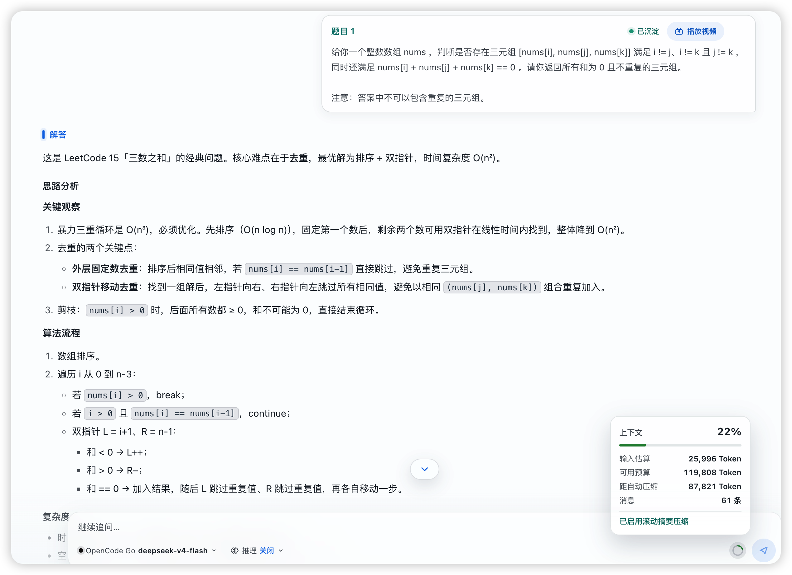
</p>

### Observable AI Usage

Input, output, cached tokens, and tool calls are reported for both the active conversation and complete history. Learning management can run automatically without hiding its resource use.

<p align="center">
  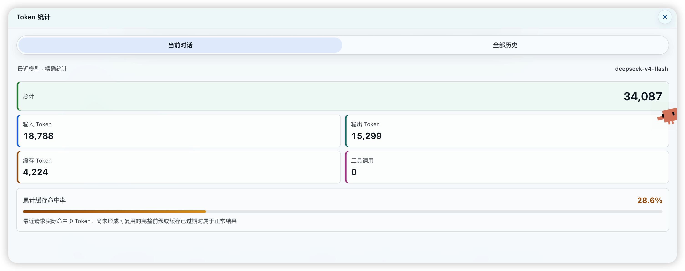
</p>

<a id="core-capabilities"></a>

## Core Capabilities

- **AI manages the complete learning loop**: you only need to ask naturally, solve problems, submit code, and take assessments. Capture, deduplication, diagnosis, classification, mastery updates, review prioritization, topic synthesis, and progress reporting connect automatically without a separate note-taking workflow.
- **Automatic knowledge capture, not manual bookmarking**: only unseen user messages and new submissions are analyzed incrementally. Each item retains a normalized problem snapshot, source references, and time. A stable `canonicalKey` merges the same concept across conversations instead of creating duplicate cards.
- **Extract the underlying concept from a specific problem**: AI maps the surface question to an algorithmic pattern, data structure, language mechanism, or common API, then records fine-grained labels and genuine prerequisites. A controlled taxonomy keeps the knowledge map stable instead of allowing the model to invent a new hierarchy on every pass.
- **Measure mastery from evidence, not exposure**: explicit gaps, repeated struggle, independent application, correct explanations, submission outcomes, and diagnostic answers become confidence-weighted signals. Mastery score, evidence count, and current state evolve with new observations, so later performance can overturn an earlier assessment.
- **A distinct learning trail for every submission**: analysis is keyed by `submissionId` and can use compiler errors, runtime failures, failed cases, pass counts, code differences, and performance changes. A new implementation never inherits an old conclusion, and a delayed older task cannot overwrite a newer cumulative summary.
- **Review driven by both weakness and memory**: FSRS schedules intervals while mastery, confidence, overdue time, and weak-item priority determine the daily queue. The plan changes as new evidence arrives instead of behaving like a fixed reminder list.
- **Every review produces new evidence**: the system generates a minimal lesson and a targeted multiple-choice, short-answer, completion, or coding exercise. Evaluation identifies demonstrated strengths, remaining gaps, and one actionable next step, then feeds the result back into mastery and scheduling.
- **A knowledge map that matures into reusable methods**: items aggregate under stable topics to reveal coverage, mastery distribution, and related problems. Once a topic has enough evidence, the system derives recognition cues, steps, concrete pitfalls, and a compilable general code skeleton rather than storing one problem's answer.
- **Context is maintained by the system, not handed back to the user**: context share, estimated input, remaining budget, and compression threshold remain visible. Rolling summaries preserve the active problem and key conclusions during long conversations, so users can continue asking without repeatedly pasting the prompt or compressing history themselves.
- **Focused, replaceable supporting tools**: video appears only for LeetCode problems or clearly durable learning topics. AI routing supports DeepSeek, Alibaba Cloud, OpenCode Go, and compatible endpoints. Eclipse JDT LS is optional, while local Java assistance remains available without a server.

<a id="how-it-works"></a>

## How It Works

The user produces authentic learning activity; the application organizes everything that follows around that evidence instead of accumulating chat history. Original questions and judge results establish what happened, AI structures, diagnoses, and summarizes it, and the scheduler determines what comes next.

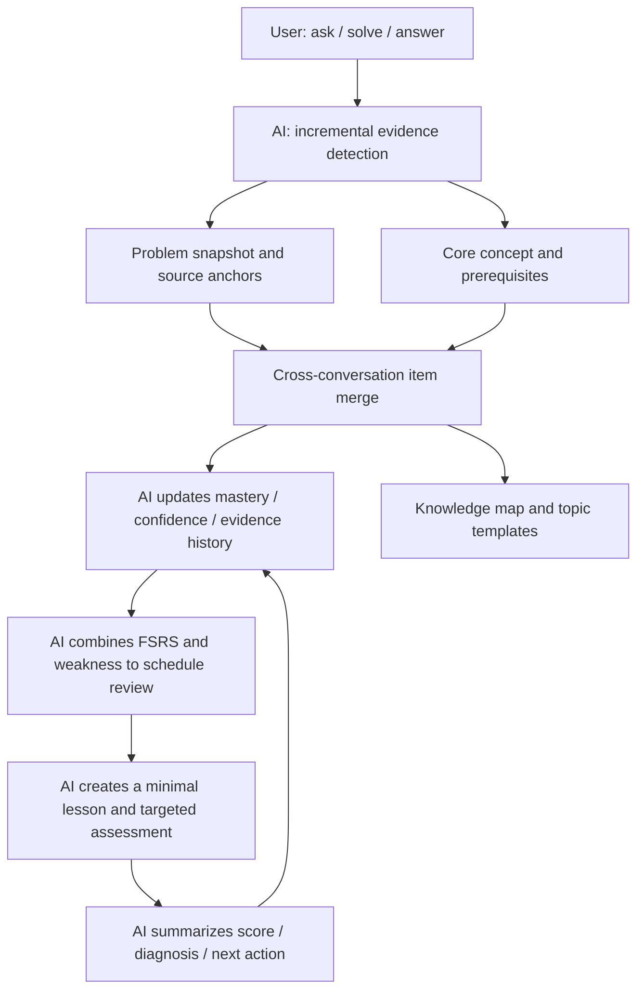

Three rules keep the loop honest: model answers are not evidence of learning; seeing a solution is not mastery; and attempts are appended rather than overwritten, so every assessment remains traceable to a question, submission, or diagnostic result.

<a id="context-architecture"></a>

## Context Architecture

Many AI learning tools keep a fixed number of recent messages or truncate history only after a request fails. This project treats context as an observable, compressible budget with explicit retention priorities. You continue the conversation while the application keeps the active problem, constraints, and reasoning coherent inside the model window.

| Common approach | This project |
| --- | --- |
| Keep the last N messages | Retain content by token budget, so one large code block does not distort the window |
| Delete the oldest messages at the limit | Pin system instructions and the original problem, inject a rolling summary, then fit the most complete recent tail |
| Re-summarize the entire history | Persist a summary cursor and process only content added since the previous summary |
| Start compression when the user is waiting | Prewarm near 80% utilization, trigger at 95% by default, and target roughly 82% after compression |
| Hide why the context became shorter | Show estimated input, available budget, tokens to compression, message count, and image count; display exact provider usage when returned |
| Send images without a budget | Accept HTTPS images only, deduplicate and cap them, gate them by model vision support, and attach at most four per request |

Token estimates use separate weights for CJK text, Latin text, code punctuation, and whitespace, with per-message caching to keep long conversations responsive. If summarization fails, the current study context is not discarded: the recent tail remains available and compression can recover on a later attempt. Alibaba-compatible endpoints also receive ephemeral cache markers on sufficiently long stable prefixes, while short prompts use the provider's default behavior.

The default window is 128K tokens with 8K reserved for output. Window size, recent-message retention, and image budget are configurable. Live utilization is intentionally conservative; usage returned by the provider is the precise accounting source.

## Security

- The repository contains no API keys, account cookies, SSH private keys, or deployment addresses.
- Provider keys are entered in the application and encrypted with Electron `safeStorage` before local persistence. Existing plaintext settings are migrated after startup.
- To generate answers, summaries, and submission reviews, relevant problems, questions, and code are sent to the AI provider you select. Choose a provider and account whose privacy policy fits your requirements.
- Conversations, learning items, and submission analyses are stored as JSON in the local application data directory and are not currently encrypted at rest. Protect the local account and inspect logs or backups before sharing them.
- LeetCode and Bilibili login state stays in isolated Electron sessions and is never stored in the repository.
- Remote Java completion is disabled until it is explicitly configured with local environment variables.
- `.env.local`, private keys, dependencies, application data, and build output are ignored by Git.

See [SECURITY.md](SECURITY.md) for reporting and credential-handling guidance.

<a id="quick-start"></a>

## Quick Start

### Download and Install

Download the Apple Silicon build from [GitHub Releases](https://github.com/huaxx-lab/leetcode-ai-helper/releases/latest):

- `LeetCode-助手-mac-arm64.dmg`: open it and drag the application into Applications;
- `LeetCode-助手-mac-arm64.zip`: extract it and move the application into Applications manually.

Public builds currently use an ad-hoc local signature and are not notarized with an Apple Developer ID. On first launch, right-click the application in Finder and choose Open. If macOS still reports that the application is damaged, verify that the package came from this repository and run:

```bash
xattr -dr com.apple.quarantine "/Applications/LeetCode 助手.app"
```

### Requirements

The current build and installation workflow targets Apple Silicon macOS:

- macOS 13 or newer;
- Node.js 22 and npm;
- Xcode Command Line Tools;
- Python 3 for the `node-gyp` native build;
- an API key from a supported AI provider.

Install the command line tools with:

```bash
xcode-select --install
```

Use `nvm`, `fnm`, or Homebrew to install Node.js 22. The project includes an Electron native module, so do not skip dependency install scripts.

### Install and Run

```bash
git clone https://github.com/huaxx-lab/leetcode-ai-helper.git
cd leetcode-ai-helper
npm install
npm start
```

If macOS blocks the local Electron binary, use the startup script. It clears quarantine attributes and applies a local ad-hoc signature:

```bash
chmod +x start.sh
./start.sh
```

### First-Time Setup

1. Open Settings and select DeepSeek, Alibaba Cloud, OpenCode Go, or add a custom provider.
2. Enter the API Base URL, API key, and model; refresh the model list and save.
3. Open Learning Activity > LeetCode and sign in to LeetCode China.
4. Import a study plan or synchronize submissions, then open a problem to run, submit, and review code.

Application data is stored outside the repository at:

```text
~/Library/Application Support/leetcode-ai-helper/
```

Deleting the source checkout or rebuilding the app does not remove this data. Redact account information, source code, history, and credentials before sharing logs.

<a id="build"></a>

## Build

Build an Apple Silicon `.app`, signed zip archive, and drag-to-install DMG:

```bash
npm run package:mac
```

Artifacts are written to:

```text
dist.noindex/mac-arm64/LeetCode 助手.app
dist.noindex/LeetCode-助手-mac-arm64.zip
dist.noindex/LeetCode-助手-mac-arm64.dmg
```

Build and replace the application in `/Applications`:

```bash
npm run install:mac
```

The default is an ad-hoc local signature. To use an installed Developer ID Application certificate:

```bash
MAC_CODE_SIGN_IDENTITY="Developer ID Application: Example (TEAMID)" npm run package:mac
```

## Optional Remote Java Completion

Without the remote service, local syntax validation and basic completion remain available. The remote HTTP gateway listens only on `127.0.0.1` and is reached through an SSH local port forward.

### 1. Deploy the server

Use a Debian or Ubuntu server. Upload the service directory and run the installer:

```bash
scp -r scripts/remote-lsp ubuntu@example.com:/tmp/leetcode-lsp
ssh ubuntu@example.com
cd /tmp/leetcode-lsp
sudo bash install.sh
```

The script installs Java 21, Eclipse JDT LS, and a systemd unit. Verify it with:

```bash
sudo systemctl status leetcode-lsp
curl http://127.0.0.1:9092/health
```

Do not expose port 9092 through the server firewall. The desktop client reaches it through SSH.

### 2. Configure the client

```bash
cp .env.example .env.local
```

Edit `.env.local`:

```dotenv
LEETCODE_LSP_SSH_HOST=example.com
LEETCODE_LSP_SSH_USER=ubuntu
LEETCODE_LSP_SSH_PORT=22
LEETCODE_LSP_TARGET_PORT=9092
LEETCODE_LSP_SSH_IDENTITY_FILE=/absolute/path/to/ssh_private_key
```

Verify key permissions and non-interactive SSH access, then launch through the script:

```bash
chmod 600 /absolute/path/to/ssh_private_key
ssh -o BatchMode=yes ubuntu@example.com true
./start.sh
```

`.env.local` is ignored by Git. Never put private key contents in an environment file.

## Commands

| Command | Purpose |
| --- | --- |
| `npm start` | Prepare renderer assets and launch the development app |
| `./start.sh` | Load `.env.local`, locally sign Electron, and launch |
| `npm run rebuild:native` | Rebuild the macOS native module for the current Electron version |
| `npm run package:mac` | Build the `.app` and zip archive |
| `npm run install:mac` | Build and install into `/Applications` |

## Repository Layout

```text
src/main/                   Electron lifecycle, IPC, and restricted preload bridges
src/renderer/               Desktop interface, interaction state, and visual styles
src/core/                   Learning engine, knowledge merging, code checks, content processing
src/integrations/           LeetCode, video, AI providers, and streaming protocols
src/platform/               macOS window placement, display profiles, and media cache
assets/                     Application and provider icons
native/                     Native macOS Liquid Glass and window capabilities
scripts/                    Build, signing, install, and optional remote LSP scripts
test/                       Regression and security tests without account data
docs/screenshots/           Real product screenshots used by the README
```

## Contributing

Read the [contribution guide](CONTRIBUTING.md) and run the regression suite before submitting a change. Do not commit real API keys, cookies, server addresses, private keys, application data, or build output. The project is available under the [MIT License](LICENSE).

> LeetCode is a trademark of its respective owner. This independent open-source project is not affiliated with or endorsed by LeetCode.
