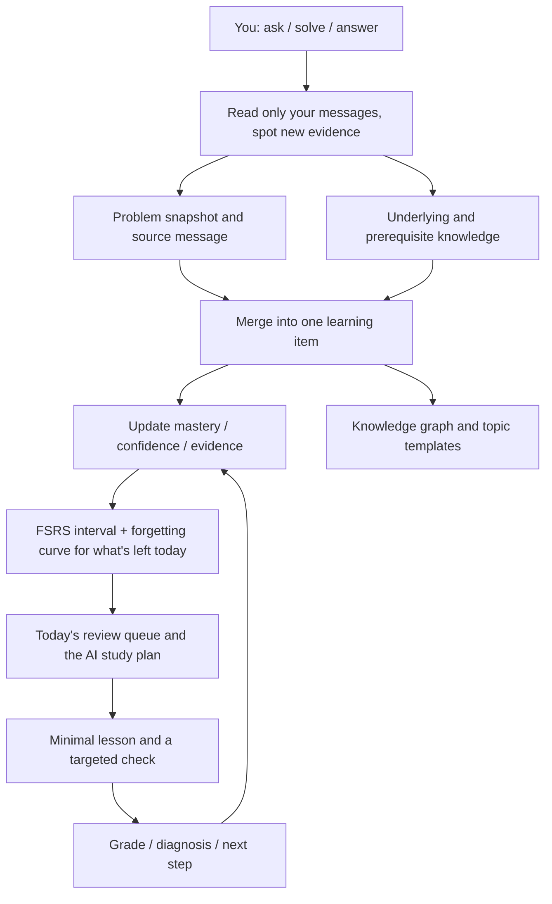

<p align="center">
  
</p>

<h1 align="center">LeetCode AI Helper 2.0</h1>

<p align="center"><strong>You ask and you write. It remembers the rest for you.</strong></p>

<p align="center">Those "wait, why does this work" questions you fire off while solving problems usually vanish the moment they're answered. This app catches them, turns them into knowledge items, and schedules them for review along the forgetting curve — no notes to keep, no review calendar to maintain.</p>

<p align="center">
  
  
  
  
  <a href="LICENSE"></a>
</p>

<p align="center">
  <a href="#how-it-differs">How it differs</a> ·
  <a href="#it-mines-your-own-questions">Mining your questions</a> ·
  <a href="#at-a-glance">At a glance</a> ·
  <a href="#the-app">The app</a> ·
  <a href="#what-it-can-do">What it can do</a> ·
  <a href="#getting-started">Getting started</a> ·
  <a href="README.md">简体中文</a>
</p>

<p align="center">
  <a href="https://github.com/huaxx-lab/leetcode-ai-helper/stargazers">
    
  </a>
</p>

<p align="center"><strong>⭐ If you find it useful, drop a Star — that is the most concrete reason for me to keep building it.</strong></p>

---

The hard part of studying algorithms was never "I don't know this". It's "I definitely understood this last week". Notes have to be written, tags applied, review scheduled — and keeping all that up costs more energy than solving problems does. Two weeks in, it falls apart.

This app takes that part over. You ask, write, and submit as usual; alongside you, it turns the gaps you expose into knowledge items, judges how well you actually know them, and decides which day to pull each one back out.

| What you do | What it does in the background |
| --- | --- |
| Ask "why is it `j >= 0` here?" | Recognizes a gap, files it under binary search, remembers which message it came from |
| Submit code and fail | Reads the compile error and failing cases, records what broke and what to watch next time |
| Ask something similar a day later | Merges into the same item, evidence +1, instead of creating a duplicate card |
| Ignore that problem for three weeks | Works out that roughly 60% of it is left in your memory and queues it for today's review |

<a id="how-it-differs"></a>

## How it differs

The blunt part first: **this is a real native macOS app**, not a wrapped web page. 2.0 rewrote every screen in SwiftUI with Swift 6 strict concurrency. The download is 9MB, the cold start reads only the indexes it needs and hydrates the rest in the background, scrolling is native — and there's no Chromium living in your Activity Monitor for the sake of a study tool.

| | A typical AI practice tool | This |
| --- | --- | --- |
| Form factor | Web app or wrapper, often 100MB+ | Native macOS app, 9MB |
| What you get | The answer, the editorial | Direction and sticking points; you still write the code |
| What counts as "learned" | Streaks and problem counts | Your questions, submissions, and answers — minus what you've forgotten |
| How review is ordered | Fixed reminders | FSRS interval + forgetting curve + weakness, reordered every day |
| Who keeps the notes | You | AI grows the tree from real problems; you only add what you want to write |
| Models | Locked to one vendor | Any compatible provider, ten task classes routable separately |
| What it costs you | Hard to say | Ledgered per provider, model, and task, exact and estimated kept apart |

<a id="it-mines-your-own-questions"></a>

## It mines your own questions for what you don't know

This is where everything starts, and where it differs most from "a chat window plus a bookmarks folder".

You never press "add to study" or tag anything. You just talk: ask about the constraints, ask how an API behaves, ask why this line goes out of bounds. Those messages are the best study material there is — **they point precisely at what you don't know**.

The app reads only what *you* wrote, never the model's answers. However well the model explains something, that's the model knowing it, not you.

From those messages it does four things:

1. **Decides whether it's study material at all.** Small talk produces nothing. Algorithm problems become problem items; syntax, standard-library APIs, data structures, and tooling become knowledge items.
2. **Files it under a fixed taxonomy.** Knowledge paths come from a controlled vocabulary (patterns, data structures, languages, common APIs, engineering tools, CS fundamentals) — the model is never allowed to invent its own folders, or the graph rots within weeks.
3. **Judges where you stand.** Gap, struggling, learning, applying, explaining, mastered — every judgement carries a confidence, and later performance can overturn an earlier one. Reading the answer doesn't count.
4. **Merges across conversations.** One stable key per concept, so asking again adds evidence instead of spawning another identical card.

A real example: you ask "can a Java stack or queue hold arrays, and how do I build a 2D array out of them?" — that becomes a knowledge item under *Common APIs › Collections*, with the diagnosis "unsure how collections store arrays and how 2D arrays are constructed", wired into the knowledge graph and queued for review. You did nothing.

<p align="center">
  
</p>

The percentage on each branch is how much you still remember, not the score you had the day you learned it. Delete a concept and the notes and links hanging off it are cleaned up with it — no wires pointing at nothing.

<a id="at-a-glance"></a>

## At a glance

<table>
<tr>
<td width="33%" valign="top">

### 🖥 Actually native

SwiftUI + Swift 6, a 9MB download, fast launch, no dropped frames.

</td>
<td width="33%" valign="top">

### 🧠 Mastery that fades

"Learned once" and "still know it" are different numbers; the app only trusts the second.

</td>
<td width="33%" valign="top">

### 💡 Directions only

Three hint tiers read your code without ever writing it for you.

</td>
</tr>
<tr>
<td valign="top">

### 🗺 A graph that grows itself

The tree is derived from real problems; you only add your own notes, editing them in place.

</td>
<td valign="top">

### 🧾 The bill adds up

Ten task classes routed separately, tokens ledgered per provider, model, and task.

</td>
<td valign="top">

### 🗄 Local first, backends optional

Data stays on your machine; add Redis and pgvector only when you want to share it.

</td>
</tr>
</table>

<a id="the-app"></a>

## The app

### Practice: statement, judge, and hints on one screen

<table>
<tr>
<td width="50%" align="center"><br><sub><b>Every submission reviewed on its own</b>: compile errors, failing cases, and source diffs stay with the attempt they belong to, ending in "shore up / do next"</sub></td>
<td width="50%" align="center"><br><sub><b>Ask only when stuck</b>: direction first, then where you're stuck, then the next single step — never the full solution</sub></td>
</tr>
<tr>
<td width="50%" align="center"><br><sub><b>An editor you can work in</b>: syntax checking and formatting, plus type and API completion once Eclipse JDT LS is connected</sub></td>
<td width="50%" align="center"><br><sub><b>A plan you don't fill in</b>: AI picks what comes first, the app decides which day and slot from your quota</sub></td>
</tr>
</table>

### Conversation, browser, and models

<table>
<tr>
<td width="50%" align="center"><br><sub><b>That's a real browser on the right</b>: tabs, sign-in, editorials; its code blocks share highlighting and copying with the conversation on the left</sub></td>
<td width="50%" align="center"><br><sub><b>You pick the models</b>: an expensive one for conversation, a cheap one for titles; keys go to the keychain and the UI only says "configured"</sub></td>
</tr>
</table>

<a id="what-it-can-do"></a>

## What it can do

### Learning

| | |
| --- | --- |
| **Only looks at what's new** | Each pass analyzes only unprocessed messages and submissions, never re-burning the same context |
| **One card per concept** | Merged across conversations by a stable key, with evidence stacking up |
| **Concepts out of problems** | A problem is split into patterns / data structures / language mechanics / common APIs |
| **Mastery can be overturned** | Every signal carries a confidence, so solving it today rewrites last week's verdict |
| **Forgetting is counted** | FSRS retention gives "how much is left", and the whole app reads that one number |
| **Today's review** | Queued by quota, overdue and most-forgotten first, with manual grading available |
| **Review means doing** | Multiple choice, short answer, code completion, or a coding task; the grade feeds mastery and the next due date |
| **Templates grow themselves** | Once a topic has enough problems, its conditions, steps, pitfalls, and a compilable skeleton are distilled |
| **Insights** | Topic distribution, weak spots, what's due in the coming days, mastery trend |
| **Trash** | Deleted by mistake? Get it back |

### LeetCode

| | |
| --- | --- |
| **Sign in inside the app** | LeetCode China runs in its own isolated session; WeChat / QQ / GitHub popup sign-in all work |
| **Lists and sync** | Import lists like Hot 100 and pull submissions directly by `titleSlug` |
| **Native statements** | Examples, constraints, and hints included, with the same code styling as everywhere else |
| **Run and submit** | Results are polled after submitting, with compile errors, failing cases, passed counts, runtime and memory parsed out |
| **Editorials in-app** | Official and community editorials, multi-image posts folded into a carousel, editorial videos playing in place |
| **Problem action bar** | Upvote, discuss, favourite, share, official hints, and how many people are solving it right now |
| **Prev / next** | Work down a list without going back to the index |
| **Activity heatmap** | Submission heatmap, streaks, weekly rhythm, difficulty split |

### Conversation

| | |
| --- | --- |
| **Streaming answers** | Watch them arrive, stop them any time; reasoning effort off / low / high / maximum |
| **Context you can see** | How much is used, what's left, how many tokens until compaction — all on screen |
| **Rolling summary** | Summaries pre-warm before the limit; system instructions and the current problem are always kept |
| **No getting lost** | Jump between questions, long prompts collapse, one click back to the bottom |
| **Cross-conversation memory** | Off / index only / retrieve — your call |
| **Images** | HTTPS only, deduplicated and capped, attached only for models that support vision |

### Browser and tool column

| | |
| --- | --- |
| **Real tabs** | Tool tabs and web tabs on one strip, narrowing as they multiply, following your cursor when dragged |
| **Session restore** | Reopen and your tabs are still there; switch it off if you'd rather not |
| **History and downloads** | History is browsable and clearable, downloads can ask where to save |
| **Popups work** | `window.open` and `target=_blank` behave, so OAuth never blows away the page you were on |
| **Switch away, playback pauses** | Background tabs don't keep videos running |
| **Where links open** | In-app or system browser, your choice |
| **Bilibili video** | The entry shows up only when AI judges the topic worth studying properly |

### Models and usage

| | |
| --- | --- |
| **Swap providers freely** | DeepSeek, Alibaba Cloud, and OpenCode Go built in, any compatible endpoint addable, model names typeable by hand |
| **Ten routes** | Conversation, titles, video matching, evidence analysis, study plan, lessons and questions, grading, submission analysis, memory, coding hints |
| **The ledger** | Input, output, cached, and reasoning tokens plus tool calls, split by conversation / task / provider / model |
| **No fudging** | Only provider-reported usage counts as exact; everything else is labelled as an estimate |
| **Failures count too** | A structured task is successful only after decoding, semantic validation, and local processing all pass |
| **Where keys live** | The system keychain; the UI only says "configured", and provider URLs pass an HTTPS policy check |

### The interface itself

| | |
| --- | --- |
| **Liquid glass** | One material for cards, capsules, and popovers, over a gradient that gives it something to refract |
| **Hand-drawn scrollbars** | Fade in while scrolling, out at rest, never stealing layout width |
| **Motion with a reason** | Separate timings for selection, panels, and fades; drags are tweened so wires and cards move in the same frame |
| **Windows** | Always on top, full screen, cross-display position memory, single-instance guard |
| **Appearance** | System / light / dark, text scaling with the system size |
| **Tests** | 216 XCTest + 100 Swift Testing on the native side, 103 on the Electron side, green before anything ships |

## How the loop turns

You produce real learning behaviour; the app picks up everything after that. Your raw questions and the judge results say what happened, AI structures and attributes it, and the scheduler decides what comes next.



Three rules hold throughout: a model answer is not your evidence; reading an editorial is not mastery; attempts are appended, never overwritten. So any mastery judgement can be traced back to one specific question, submission, or answer.

## Privacy and security

- The repository holds no API keys, cookies, SSH private keys, or server addresses.
- The native client keeps provider keys in the system keychain; the Electron client encrypts them with `safeStorage`. Neither echoes a stored key back.
- To generate answers, summaries, and submission analysis, problems, questions, and related code are sent to the provider you picked — choose models and accounts according to their privacy policy.
- Conversations, learning items, and analyses live as JSON in the local application-data directory, unencrypted at rest. Look before you share logs or backups.
- LeetCode and Bilibili sessions stay in the app's isolated web session and never reach the repository.
- Remote Java completion is off unless you explicitly configure it through environment variables.
- `.env.local`, build output, dependency directories, debug captures, and key files are all in `.gitignore`.

Details in [SECURITY.md](SECURITY.md).

<a id="getting-started"></a>

## Getting started

### Just download it

Grab the Apple Silicon build from [Releases](https://github.com/huaxx-lab/leetcode-ai-helper/releases/latest): drag the `.dmg` into Applications, or unzip and move it yourself.

Builds are ad-hoc signed and not notarized, so right-click → Open the first time. If macOS still claims it's damaged, confirm the package came from this repository and run:

```bash
xattr -dr com.apple.quarantine "/Applications/LeetCode AI 助手.app"
```

### Build it yourself (native, 2.0)

Requires macOS 15+, Apple Silicon, and Xcode 26 with the Swift 6 toolchain.

```bash
git clone https://github.com/huaxx-lab/leetcode-ai-helper.git
cd leetcode-ai-helper/native
swift build
swift test
./scripts/build-release-app.sh      # produces .app + zip + dmg
```

If the repository lives in an iCloud / File Provider directory, codesigning the resource bundle can fail because of extended attributes. Move the build directory out:

```bash
swift build --scratch-path /tmp/leetcode-native-build
```

### The Electron client (1.x)

The older client is still in `src/` with its scripts intact; needs Node.js 22.

```bash
npm install
npm start              # or ./start.sh
npm run install:mac    # build and install into /Applications
```

### First run

1. Settings → Model Providers: pick DeepSeek, Alibaba Cloud, OpenCode Go, or add your own.
2. Fill in the API base, key, and model, refresh the model list and save; route individual tasks elsewhere if you want.
3. Sign in to LeetCode China in the built-in browser.
4. Import a list or sync your submissions, then run, submit, and read the analysis in the problem workspace.

Data lives in `~/Library/Application Support/leetcode-ai-helper/`. Deleting the repository or rebuilding never touches it. Strip accounts, code, problem history, and credentials before attaching logs to an issue.

## Optional backends

All three are skippable. Without them, analyses and vectors live in local files and Java falls back to local syntax checking and basic completion — everything still works. With them, every client you run shares one cache and one vector store. Deployment lives in [`scripts/remote-services`](scripts/remote-services) and [`scripts/remote-lsp`](scripts/remote-lsp).

| Service | What it does | If it goes down |
| --- | --- | --- |
| Redis | Hot cache for analyses, submission details, and usage counters, shared by both clients | Every call is deadline-bounded, the breaker trips, and it falls back to local files |
| PostgreSQL + pgvector | 640-dimensional vector store for cross-conversation retrieval | The layer pauses for two minutes and retrieval falls back to the local cache |
| Eclipse JDT LS | Java completion | Falls back to local syntax checking and basic completion |

All three listen on `127.0.0.1` only and are reached over an SSH local port forward. **Do not open 6379 / 5432 / 9092 in a firewall.**

### Redis and pgvector

```bash
scp -r scripts/remote-services ubuntu@example.com:/tmp/leetcode-services
ssh ubuntu@example.com
cd /tmp/leetcode-services
cp .env.example .env && $EDITOR .env && chmod 600 .env
docker compose up -d
```

Open the tunnel on the client, then fill in the addresses, accounts, and passwords under Settings → Data & Cache and hit test connection (passwords go to the keychain):

```bash
ssh -f -N -L 6379:127.0.0.1:6379 -L 5432:127.0.0.1:5432 ubuntu@example.com
```

The app creates the vector table itself; `init-pgvector.sql` just makes the first deployment complete and adds the nearest-neighbour index.

### Java completion service

```bash
scp -r scripts/remote-lsp ubuntu@example.com:/tmp/leetcode-lsp
ssh ubuntu@example.com
cd /tmp/leetcode-lsp
sudo bash install.sh
curl http://127.0.0.1:9092/health
```

Client settings go into `.env.local` (never tracked by Git — and never put private key material in it):

```dotenv
LEETCODE_LSP_SSH_HOST=example.com
LEETCODE_LSP_SSH_USER=ubuntu
LEETCODE_LSP_SSH_PORT=22
LEETCODE_LSP_TARGET_PORT=9092
LEETCODE_LSP_SSH_IDENTITY_FILE=/absolute/path/to/ssh_private_key
```

## Common commands

| Command | Purpose |
| --- | --- |
| `cd native && swift build` | Build the native client |
| `cd native && swift test` | Native regression tests |
| `native/scripts/build-release-app.sh` | Produce `.app` + zip + dmg |
| `npm start` / `./start.sh` | Run the Electron client |
| `npm test` | Electron regression tests |
| `npm run install:mac` | Build and install the Electron client |

## What's in the repo

```text
native/Sources/             Native client: views, models, services, bundled resources
native/Tests/               Native regression tests
native/scripts/             Icon generation, preview and release build scripts
src/main/                   Electron lifecycle, IPC, and the preload bridge
src/renderer/               Electron UI and styling
src/core/                   Learning engine, knowledge merging, code checks, content processing
src/integrations/           LeetCode, video, provider, and streaming-protocol adapters
src/platform/               macOS window layout, display configuration, media cache
assets/                     App and provider icons
scripts/remote-services/    Optional backends: Redis + pgvector compose file and init SQL
scripts/remote-lsp/         Optional backend: Eclipse JDT LS installer and systemd unit
scripts/                    Build, signing, and install scripts
test/                       Regression and security tests with no account data
docs/screenshots/           Real screenshots used by this README (1.x archived in legacy-electron/)
docs/ui-optimization/       Design and rework notes per screen
```

## Contributing

Read the [contribution guide](CONTRIBUTING.md) and run both test suites before submitting. Never commit real API keys, cookies, server addresses, private keys, application data, or build output. Licensed under [MIT](LICENSE).

> LeetCode is a trademark of its respective owner. This is an independent open-source tool with no affiliation with or endorsement by LeetCode.
