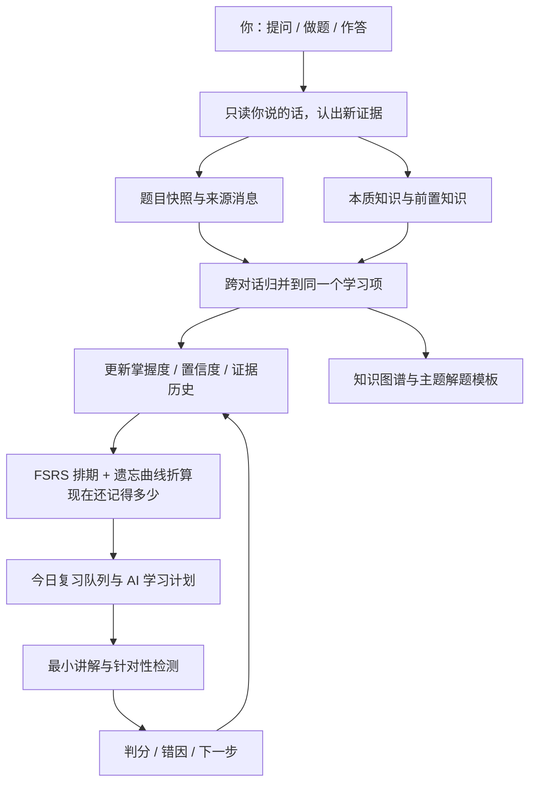
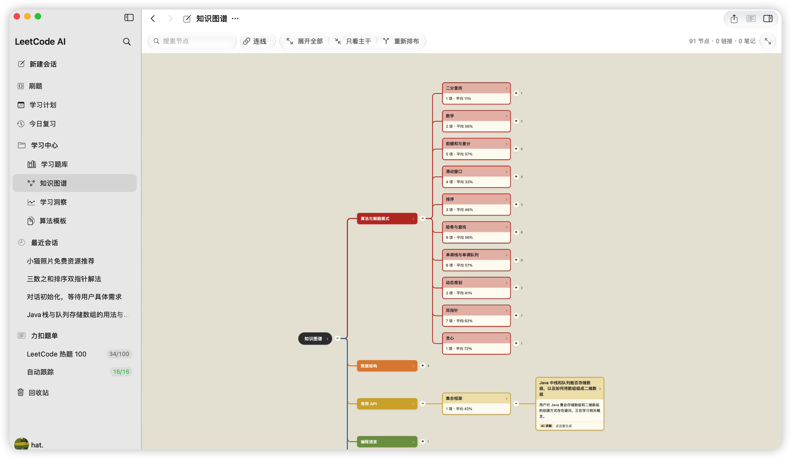
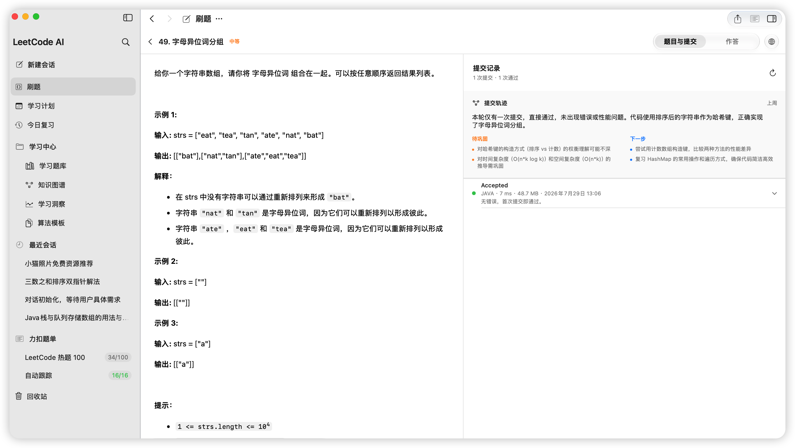
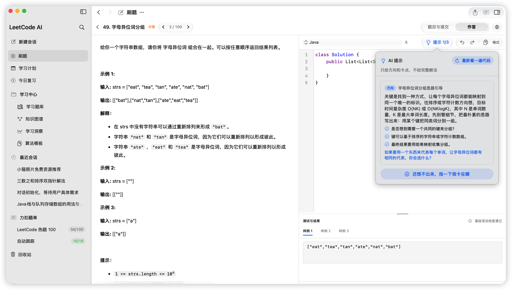
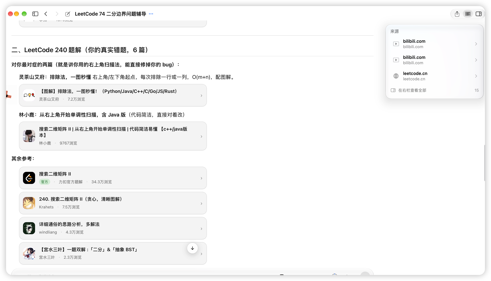
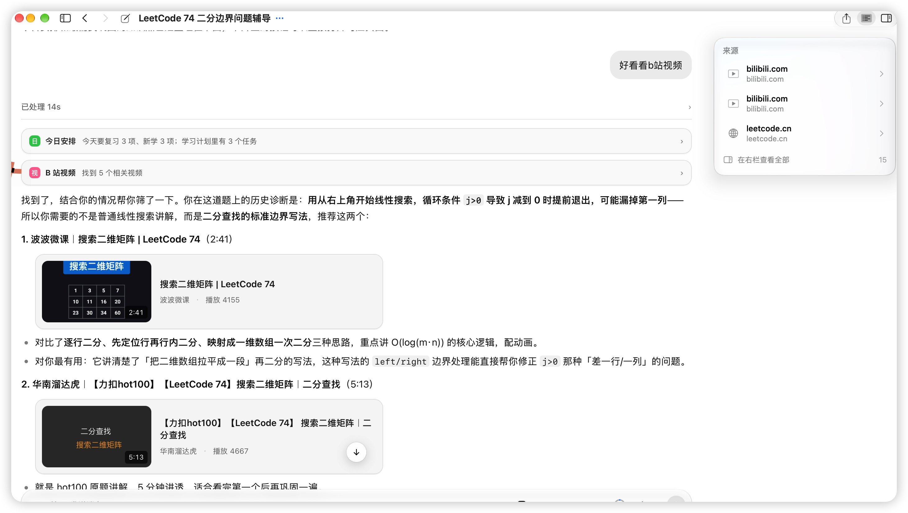
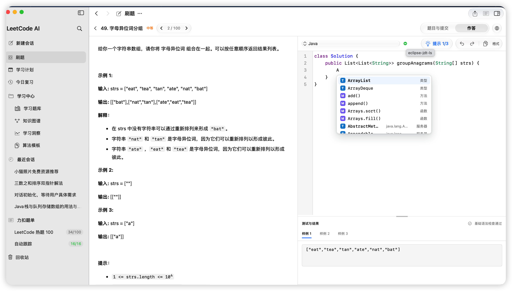
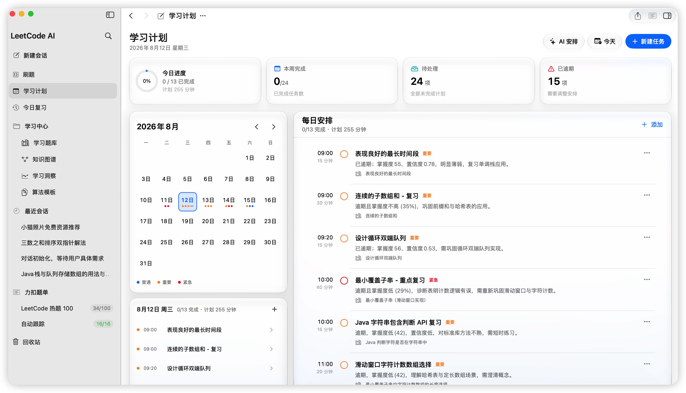
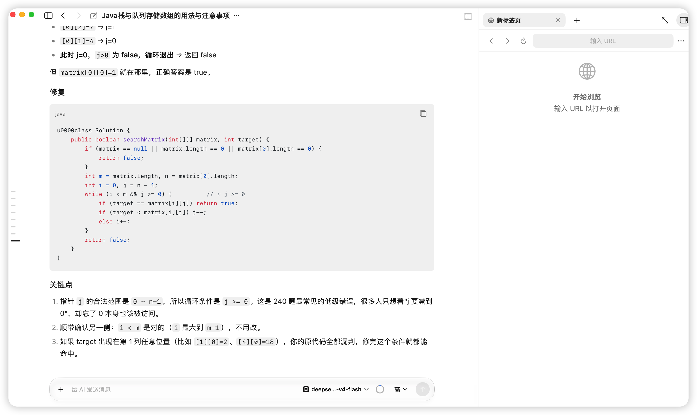

<p align="center">
  
</p>

<h1 align="center">LeetLens</h1>

<p align="center">
  面向算法学习的力扣刷题客户端。AI 从提问、对话和提交记录里积累知识、发现薄弱点，生成脑图并安排复习。
</p>

<p align="center">
  
  
  
  <a href="LICENSE"></a>
  <a href="https://github.com/huaxx-lab/LeetLens/stargazers"></a>
</p>

<p align="center">
  <a href="https://github.com/huaxx-lab/LeetLens/releases/latest"><b>下载</b></a> ·
  <a href="#能做什么">能做什么</a> ·
  <a href="#截图">截图</a> ·
  <a href="#安装">安装</a> ·
  <a href="#可选服务">可选服务</a> ·
  <a href="README.en.md">English</a>
</p>

---

LeetLens 面向[力扣中国站](https://leetcode.cn)，给学算法的人用：写代码、跑样例、交判题都在应用里。AI 把刷题过程收成知识——提问和对话里记下你会什么，历史提交里交叉判断真正不会什么，抽成本质知识画进脑图，再自动排进复习。需要讲解时再去查题解和视频。



<p align="center">
  
</p>
<p align="center"><sub>脑图由提问、对话和提交长出来。百分比是现在还记得多少，不是当初学会时的分数。</sub></p>

## 能做什么

**对话**

- 问到你自己的掌握情况、某题提交、今日安排时，会去查本地数据，而不是编。
- 可以检索力扣社区题解（官方优先）和 B 站公开视频；引用会做成卡片，点开在右侧打开。
- 每天第一次进对话页，会先给一份本地简报：今日队列和最该补的几项，不消耗额度。
- 流式输出，可随时打断；推理强度关 / 低 / 高 / 最高。上下文占用看得到。
- 跨会话能记得你是谁、常用什么、以前聊过什么。设置里可以查看和删掉这些长期事实。

**刷题**

- 内置浏览器登录力扣中国站（微信 / QQ 等弹窗登录可用），导入题单，按题同步提交。
- 应用内跑样例、交判题：编译错误、失败用例、通过数、耗时内存都会解析出来。
- 编辑器支持 Java、C++、Python、JavaScript、TypeScript；本地有语法检查和格式化。接上 Eclipse JDT LS 之后，Java 能做类型和 API 补全。
- 官方和社区题解可以直接看，带图的收进轮播，题解视频就地播。
- 提交热力图、连击、难度分布。

**学习**

- AI 从提问、对话和历史提交多路判断掌握情况；模型讲得好不算你学会了。
- 不会的本质知识归到脑图上，同一知识点跨对话合并，不堆重复卡片。
- 后续自动加进今日复习。按配额出队，逾期和忘得多的排前面。题型是选择、简答、代码补全或编程题，判分写回下次到期。也可以自己打分。
- 同一主题题目够了，会归纳适用条件、步骤、常见坑和可编译骨架。
- 学习洞察、学习计划（日历可手改；AI 建议学什么，具体钟点按你的配额排）。

右侧是真正的浏览器：多标签、能登录、关掉再开还在，切走的标签会暂停播放。

## 截图

<table>
<tr>
<td width="50%" align="center"><br><sub>每次提交单独复盘，最后落到待巩固和下一步</sub></td>
<td width="50%" align="center"><br><sub>刷题页的提示：先方向，再卡点，不给完整解法</sub></td>
</tr>
<tr>
<td width="50%" align="center"><br><sub>官方题解在前，其余按浏览量；卡片点开在右侧读正文</sub></td>
<td width="50%" align="center"><br><sub>可以按你这题栽过的点去搜讲解视频</sub></td>
</tr>
<tr>
<td width="50%" align="center"><br><sub>能写代码的编辑器；配好 JDT LS 后 Java 有类型补全</sub></td>
<td width="50%" align="center"><br><sub>日历上手改，也可以让 AI 按配额给一份本周安排</sub></td>
</tr>
<tr>
<td width="50%" align="center"><br><sub>百分比是现在大概还记得多少，不是当初学会时的分数</sub></td>
<td width="50%" align="center"><br><sub>左边对话，右边浏览器，题解和网页不用跳出去</sub></td>
</tr>
</table>

## 安装

从 [Releases](https://github.com/huaxx-lab/LeetLens/releases/latest) 下载 `.dmg`（Apple Silicon，macOS 15+），拖进「应用程序」。

包是 ad-hoc 签名，没走 Apple 公证。第一次打开请右键 → 打开。如果提示已损坏：

```bash
xattr -dr com.apple.quarantine "/Applications/LeetLens.app"
```

装好后：

1. 设置 → 模型供应商，选 DeepSeek、阿里云、OpenCode Go，或自己加一个 OpenAI 兼容接口。Key 进系统钥匙串，界面只显示「已配置」。
2. 右侧浏览器里登录力扣中国站。
3. 导入题单，或同步提交记录。

数据在 `~/Library/Application Support/leetcode-ai-helper/`，重装或重新构建不会清掉。发日志前先去掉账号、代码和凭据。

不同任务可以走不同模型（主对话、摘要、学习分析、出题评分、提交分析等）。账单按对话、任务、供应商分记；供应商回传的才标精确用量，其余是估算。

## 自己构建

需要带 Swift 6 的完整 Xcode，不要只用 Command Line Tools。

```bash
git clone https://github.com/huaxx-lab/LeetLens.git
cd LeetLens/native
swift build && swift test
./scripts/build-release-app.sh   # 产出 .app + zip + dmg
```

仓库如果在 iCloud 目录里，资源包会带扩展属性，签名会失败。把构建目录指到别处即可：

```bash
swift build --scratch-path /tmp/lc-build
```

| 命令 | 作用 |
| --- | --- |
| `cd native && swift build` | 构建当前客户端 |
| `cd native && swift test` | 原生测试 |
| `native/scripts/build-release-app.sh` | 打发布包 |
| `npm test` / `npm start` | 旧版 Electron（`src/`，1.x，不再作为发布目标） |

## 可选服务

单机不装也能用：对话、刷题、复习都走本机文件。下面三件是增强，按需部署，挂了会自动退回本机，不会把应用弄停。

| 服务 | 干什么 | 不装会怎样 |
| --- | --- | --- |
| Redis | 提交分析、提交详情、用量计数的热缓存，多台电脑共用一份 | 每次超时后熔断，改走本机文件 |
| PostgreSQL + pgvector | 跨对话检索的向量库，多机共用同一份索引 | 暂停该层约两分钟，检索退回本机向量缓存 |
| Eclipse JDT LS | Java 类型和 API 补全 | 编辑器仍有本地语法检查和基础补全 |

三者都只监听 `127.0.0.1`。客户端用 SSH 本地转发进去，**不要在防火墙上放行 6379 / 5432 / 9092**。

脚本在 [`scripts/remote-services`](scripts/remote-services)（Redis + pgvector）和 [`scripts/remote-lsp`](scripts/remote-lsp)（Java 补全）。

### Redis 与 pgvector

需要一台装了 Docker 的 Debian / Ubuntu 机器。

```bash
scp -r scripts/remote-services ubuntu@example.com:/tmp/leetcode-services
ssh ubuntu@example.com
cd /tmp/leetcode-services

cp .env.example .env
# 填 REDIS_PASSWORD / POSTGRES_USER / POSTGRES_PASSWORD
# 可用 openssl rand -base64 24 生成
chmod 600 .env

docker compose up -d
docker compose ps
```

验证：

```bash
docker compose exec redis redis-cli -a "$REDIS_PASSWORD" ping
# 应返回 PONG

docker compose exec postgres psql -U "$POSTGRES_USER" -d leetcode_rag \
  -c "SELECT extname FROM pg_extension WHERE extname = 'vector';"
# 应看到 vector
```

本机开隧道（保持运行）：

```bash
ssh -f -N -L 6379:127.0.0.1:6379 -L 5432:127.0.0.1:5432 ubuntu@example.com
```

打开应用 **设置 → 数据与缓存**：

1. 打开「启用 Redis」，地址 `127.0.0.1`、端口 `6379`，填刚才的密码，点测试连接。
2. 打开「启用向量数据库」，地址 `127.0.0.1`、端口 `5432`，数据库 `leetcode_rag`，用户和密码与 `.env` 一致，点测试连接。
3. 保存。密码进系统钥匙串。

表结构由应用自动建。`init-pgvector.sql` 只是让第一次部署顺带建好近邻索引。

看日志、升级、停服务：

```bash
docker compose logs -f --tail 100
docker compose pull && docker compose up -d
docker compose down    # 数据留在 Docker 卷里
```

备份向量库：

```bash
docker compose exec -T postgres pg_dump -U "$POSTGRES_USER" leetcode_rag \
  | gzip > rag-$(date +%F).sql.gz
```

Redis 里都是能重建的缓存，不必备份。清空只会让下次分析重算一遍：

```bash
docker compose exec redis redis-cli -a "$REDIS_PASSWORD" --scan --pattern 'lca:*' \
  | xargs -r docker compose exec -T redis redis-cli -a "$REDIS_PASSWORD" del
```

### Java 补全（Eclipse JDT LS）

刷题页编辑器默认是本地语法检查。要类型和 API 补全，需要在 Linux 上跑一份 JDT LS。应用自己会建 SSH 隧道，不用像上面那样手动 `-L`。

服务器（Debian / Ubuntu，要能 `sudo`）：

```bash
scp -r scripts/remote-lsp ubuntu@example.com:/tmp/leetcode-lsp
ssh ubuntu@example.com
cd /tmp/leetcode-lsp
sudo bash install.sh
sudo systemctl status leetcode-lsp
curl http://127.0.0.1:9092/health
```

`install.sh` 会装 OpenJDK 21、Eclipse JDT LS，并启用 `leetcode-lsp` 服务，只听 `127.0.0.1:9092`。

本机：先确认密钥能免密登录。

```bash
chmod 600 ~/.ssh/id_ed25519
ssh -o BatchMode=yes ubuntu@example.com true
```

然后写配置文件（从 Dock 打开的应用读不到 shell 里的环境变量）：

`~/Library/Application Support/leetcode-ai-helper/data/lsp.json`

```json
{
  "enabled": true,
  "host": "example.com",
  "user": "ubuntu",
  "sshPort": 22,
  "targetPort": 9092,
  "identityFile": "~/.ssh/id_ed25519"
}
```

`host` 填 SSH 那台机器，不要填 `127.0.0.1`。写好后重启应用。编辑器状态会从「补全：本地」变成「补全：语义就绪」；服务不可用时退回本地语法检查。

开发时从终端启动，也可以改用环境变量，会覆盖文件里的值：

```bash
export LEETCODE_LSP_SSH_HOST=example.com
export LEETCODE_LSP_SSH_USER=ubuntu
export LEETCODE_LSP_SSH_PORT=22
export LEETCODE_LSP_TARGET_PORT=9092
export LEETCODE_LSP_SSH_IDENTITY_FILE=$HOME/.ssh/id_ed25519
```

许可证 [MIT](LICENSE)。参与前请读[贡献指南](CONTRIBUTING.md)。

> LeetCode 是其权利人的商标。本项目是独立的开源工具，与 LeetCode 官方没有隶属或背书关系。
