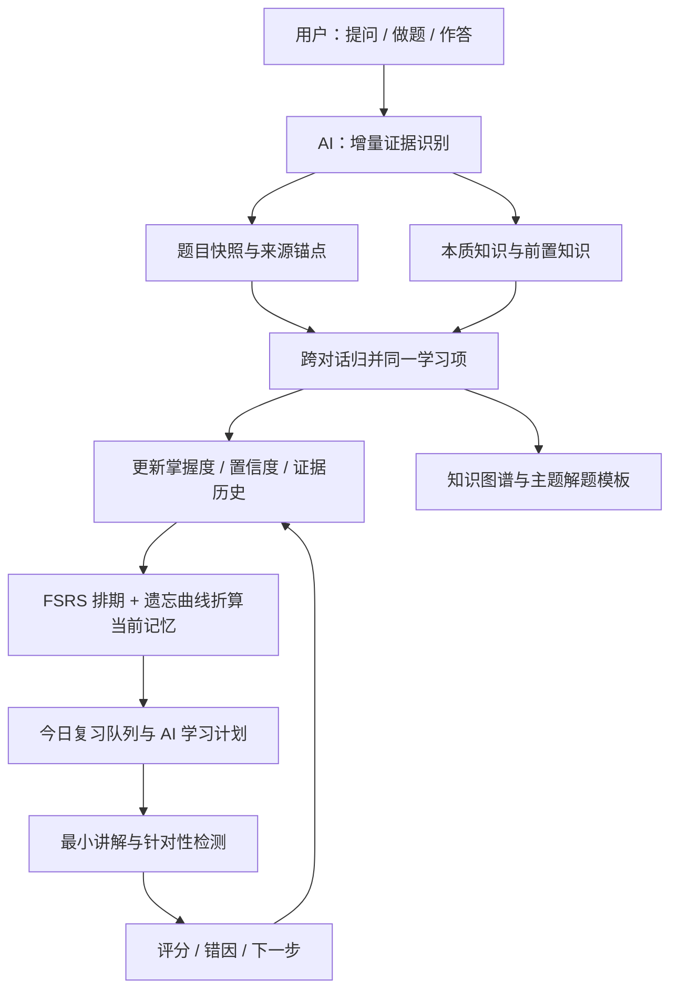

<p align="center">
  
</p>

<h1 align="center">LeetCode AI 助手 2.0</h1>

<p align="center"><strong>你只管提问、刷题和作答，AI 负责把学习自动整理成下一步。</strong></p>

<p align="center">2.0 把整个客户端用 SwiftUI 重写成原生 macOS 应用：同一套学习引擎，换成不吃内存的原生外壳、可拖动的知识图谱、分级 AI 提示，以及一条全程可查账的模型调用链路。</p>

<p align="center">
  
  
  
  
  <a href="LICENSE"></a>
</p>

<p align="center">
  <a href="#项目介绍">项目介绍</a> ·
  <a href="#为什么值得一试">为什么值得一试</a> ·
  <a href="#20-有什么新东西">2.0 新变化</a> ·
  <a href="#产品展示">产品展示</a> ·
  <a href="#核心亮点">核心亮点</a> ·
  <a href="#工作原理">工作原理</a> ·
  <a href="#快速开始">快速开始</a> ·
  <a href="README.en.md">English</a>
</p>

<p align="center">
  <a href="https://github.com/huaxx-lab/leetcode-ai-helper/stargazers">
    
  </a>
</p>

<p align="center"><strong>⭐ 如果它帮你少走了弯路，点个 Star 让更多人看到——这是这个项目继续做下去最直接的动力。</strong></p>

---

| 你只需要做 | AI 在后台自动完成 |
| --- | --- |
| 提问不懂的地方、编写并提交代码、完成复习检测 | 识别学习问题、归并重复知识、分析错因、提取前置知识、记录能力证据、更新掌握度、按遗忘曲线安排复习、总结主题模板、管理上下文与学习进展 |

<a id="项目介绍"></a>

## 项目介绍

LeetCode AI 助手不是一个自动给答案的聊天外壳，而是一套运行在 macOS 上的个人算法学习系统。它把提问、代码提交、判题结果和复习作答视为连续的学习证据，由 AI 自动完成「发现问题 → 提取本质知识 → 更新掌握判断 → 安排下一次练习」的后续工作。

它刻意不做的事同样重要：不替你写完整解法（写代码时的 AI 提示只给方向和卡点）、不把「看过题解」算作掌握、不覆盖历史尝试。每一个掌握判断都能追回到某一次具体的提问、提交或检测。

<a id="为什么值得一试"></a>

## 为什么值得一试

**真·macOS 原生，不是套壳网页。** 2.0 全部界面由 SwiftUI 重写，Swift 6 严格并发。窗口、侧栏、工具区、滚动、玻璃材质都是原生视图，冷启动是 O(1) 的：首屏只读必要索引，向量与长期记忆在后台补齐。同样的学习数据，原生版启动更快、滚动不掉帧、内存占用只有 Electron 版的一小部分，也不用为一个学习工具常驻一个 Chromium。

| | 一般 AI 刷题工具 | 本项目 2.0 |
| --- | --- | --- |
| 形态 | 网页 / 套壳客户端 | 原生 macOS 应用（SwiftUI + Swift 6） |
| 学到什么 | 给答案、给题解 | 只给方向与卡点，答案要你自己写出来 |
| 掌握度 | 打卡数、做题数 | 证据驱动，且按遗忘曲线折算「现在还剩多少」 |
| 复习 | 固定提醒 | FSRS 间隔 + 遗忘曲线 + 薄弱度动态重排 |
| 笔记 | 你自己维护 | AI 派生知识树，你只补自己的笔记与链接 |
| 模型 | 绑定单一供应商 | 任意兼容供应商，六类任务可分别路由 |
| 花了多少钱 | 不透明 | 按供应商 / 模型 / 任务分别记账，精确与估算分开 |

**核心能力都围绕一件事：让下一次练习更值得练。**

- 提交自动归因 —— 每次提交单独分析编译错误、失败用例与源码差异，得出「待巩固 / 下一步」，不复用旧结论；
- 知识自动成树 —— 从真实题目派生受控知识路径，同一知识点跨对话自动归并，不生成重复卡片；
- 复习自动排队 —— FSRS 决定间隔，遗忘曲线决定当前记忆保持率，逾期越久、忘得越多的排越前；
- 提示不越界 —— 三级提示读你当前的代码，提示词与输出后的确定性检查共同拦住完整解法；
- 上下文自动维护 —— 长对话滚动摘要、按 Token 预算装填，界面上实时显示占用与压缩距离。

**本机优先，也能接自己的后端。** 全部数据默认落在本机；需要多端共用时，可以自己接一套可选后端：Redis 做分析结果、提交详情与用量计数的热缓存，PostgreSQL + pgvector 做跨对话检索的向量库，Eclipse JDT LS 提供 Java 补全。三者都是旁路——任何一个不可用都会自动回落到本机路径，功能不会因此中断。部署脚本随仓库提供，见 [可选后端服务](#可选后端服务)。

<a id="20-有什么新东西"></a>

## 2.0 有什么新东西

2.0 的主体是 `native/` 目录下的原生 macOS 客户端（SwiftUI + Swift 6 严格并发）。学习引擎、FSRS 排期、力扣集成这些「大脑」部分继续复用，换掉的是外壳与交互。

- **原生 macOS 客户端**：SwiftUI 重写全部界面，窗口、侧栏、工具区都是原生视图；滚动条、玻璃材质、红绿灯对齐按 macOS 的规矩来，不再靠网页模拟。
- **知识图谱重做**：自绘的思维导图画布（DOM 卡片 + SVG 连线 + 自算 tidy 布局），支持折叠、拖拽改同级顺序、双指捏合缩放。详情卡是一张能拖走的备忘录——点哪段就地改哪段，点到别处即保存并渲染 Markdown；按住 Shift 从一张卡片拖到另一张就是一条链接。
- **遗忘曲线贯穿全局**：把 FSRS 的记忆保持率搬进原生侧，掌握度按「现在还记得多少」折算。今日复习排序、学习洞察、知识图谱节点、AI 学习计划用的是同一个数，不会出现「这页说该练了、那页说还很熟」。
- **写代码时的 AI 提示**：编辑器里的提示分三级（方向 → 卡点 → 下一步），每一级都读你当前的代码，但提示词与输出后的确定性检查共同保证它不会把完整解法贴给你。
- **一条可查账的模型调用链路**：所有真实模型调用统一走任务路由与中央账本，按供应商、模型、任务分别统计 Token 与成败；结构化任务必须在解码、语义校验和本地处理都成功之后才记成功。
- **内置浏览器与统一标签栏**：工具标签和网页标签排在同一条上，宽度随数量收缩，拖动跟手、其余标签实时让位。
- **可选后端：Redis 与 pgvector**：Redis 缓存分析结果、提交详情与用量计数，PostgreSQL + pgvector 存跨对话检索用的 640 维向量，多台机器上的客户端共用同一份；两者都带超时与熔断，掉线自动回落本机文件。
- **Java 智能补全**：可选接入 Eclipse JDT LS，在原生编辑器里给出类型、方法与常用 API 补全。

1.x 的 Electron 客户端仍留在 `src/`，构建与发布脚本继续可用；两者共用同一份应用数据目录。

<a id="产品展示"></a>

## 产品展示

### 知识图谱：AI 派生的知识树 + 你自己的笔记层

<p align="center">
  
</p>

知识路径由 AI 从真实题目里派生，节点显示该分支下的题目数与平均掌握度（已按遗忘曲线折算）。手工层只叠加你自己的东西：笔记、链接、排序、折叠。删掉一个知识点，挂在它上面的笔记和链接会跟着清掉，不会留下指向空气的虚线。

### 刷题：题面、提交轨迹与 AI 复盘

<p align="center">
  
</p>

每次提交按 `submissionId` 独立分析：编译错误、失败用例、通过数、源码差异都进入这一次的轨迹，然后汇成「待巩固 / 下一步」。新的尝试不会复用旧结论。

### 写代码时的 AI 提示：只给方向，不给答案

<p align="center">
  
</p>

三级提示逐级点开：先给思路方向和自检清单，卡住了再指卡点，最后才说下一步做什么。内容支持 Markdown 渲染，字号随系统文字大小缩放。

### 本地 Java 补全

<p align="center">
  
</p>

### 学习计划：AI 只决定学什么，排期由本地算

<p align="center">
  
</p>

模型只输出「该先学什么」的顺序和理由，具体排到哪一天哪一刻由本地调度器按每日配额、总时长与已占用时段决定。逾期项优先，同样逾期时记忆保持率更低的排更前面。

### 对话与内置浏览器

<p align="center">
  
</p>

对话、题解、题面、笔记、诊断里的代码块共用同一套渲染（markdown-it + highlight.js + DOMPurify），复制统一走原生剪贴板。右侧工具区是一个真正的多标签浏览器，来源、证据、预览与网页标签排在同一条标签栏上。

### 模型供应商与任务路由

<p align="center">
  
</p>

内置 DeepSeek、阿里云、OpenCode Go，也可添加任何兼容供应商。每类任务（主对话、标题摘要、学习计划、提交分析、跨对话记忆、写代码提示）都能单独指定供应商与模型。API Key 存进系统钥匙串，界面只显示「已配置」。

<a id="核心亮点"></a>

## 核心亮点

- **AI 自动管理完整学习闭环**：你只需自然提问、刷题、提交和参与检测。问题整理、重复项归并、错因总结、知识分类、掌握度更新、复习排序、主题归纳和进度统计都在后台衔接完成。
- **问题不是被「收藏」，而是被自动沉淀**：只增量分析尚未处理的消息与新提交；跨对话再遇到同一问题时按稳定的 `canonicalKey` 归并到原学习项，证据累积而不是生成重复卡片。
- **从题目表象提取本质知识**：一道具体题会被拆成算法模式、数据结构、语言机制或常用 API，分类来自受控知识路径，避免模型每次自创目录把图谱搞乱。
- **以证据判断掌握**：提问暴露的缺口、反复卡住、独立应用、正确解释、提交结果和检测作答都会形成带置信度的信号，后续表现可以推翻旧判断。
- **复习由薄弱度和记忆规律共同驱动**：FSRS 决定间隔，遗忘曲线决定「现在还剩多少」，掌握度、置信度、逾期天数共同决定今日队列的顺序。
- **复习必须产生新证据**：针对当前最小知识缺口生成短讲解与选择 / 简答 / 代码补全 / 编程检测，判分结果重新写回掌握度与下一次复习时间。
- **知识最终沉淀为可复用方法**：同一主题积累足够题目后，自动归纳适用条件、操作步骤、常见错误和可编译的通用代码骨架，而不是保存某一道题的答案。
- **上下文由系统维护**：实时显示上下文占比、输入估算、可用预算与压缩阈值，长对话自动生成滚动摘要并保留当前题目与关键结论。
- **AI 用量透明**：按对话、任务、供应商与模型分别统计输入 / 输出 / 缓存 / 推理 Token 与工具调用；精确用量与估算用量分开记，不混为一谈。
- **本机优先，后端可选**：所有数据默认留在本机；需要多端共用时再接 Redis 与 pgvector，掉线自动回落，不会把可用性押在服务器上。

<a id="工作原理"></a>

## 工作原理

用户只产生真实学习行为，应用围绕这些「证据」自动组织后续工作。原始提问与判题结果负责说明发生了什么，AI 负责结构化、归因和总结，调度器负责决定接下来学什么。



三条原则贯穿始终：模型回答本身不算学习证据；看过题解不等于掌握；历史尝试只追加、不覆盖。

## 安全设计

- 仓库不包含 API Key、账号 Cookie、SSH 私钥或服务器地址。
- 原生版的供应商密钥保存在系统钥匙串，Electron 版通过 `safeStorage` 加密后写入本机；界面只显示是否已配置，不回显原文。
- 为生成回答、摘要与提交分析，题目、提问和相关代码会发送给你选择的 AI 供应商；请按对应供应商的隐私政策选择模型与账号。
- 对话、学习项和提交分析保存在本机应用数据目录的 JSON 文件中，目前不做静态加密。请保护本机账号和磁盘，并在分享日志或备份前检查内容。
- 力扣与哔哩哔哩登录状态保存在应用自己的隔离会话中，不写入仓库。
- 远程 Java 补全默认关闭，必须通过本地环境变量显式启用。
- `.env.local`、构建产物、依赖目录、调试截图和私钥文件均已加入 `.gitignore`。

更多说明见 [SECURITY.md](SECURITY.md)。

<a id="快速开始"></a>

## 快速开始

### 环境要求

- 原生版：macOS 15 或更高版本、Xcode 26（含 Swift 6 工具链）、Apple Silicon；
- Electron 版：macOS 13 或更高版本、Node.js 22、Xcode Command Line Tools、Python 3（供 `node-gyp` 使用）；
- 一个受支持 AI 供应商的 API Key。

### 构建并运行原生版（2.0）

```bash
git clone https://github.com/huaxx-lab/leetcode-ai-helper.git
cd leetcode-ai-helper/native
swift build            # 需要 Xcode 26 的 Swift 6 工具链
swift test             # 回归测试
./scripts/build-preview-app.sh
```

脚本会生成图标、构建、清理扩展属性并本地签名，产物在：

```text
native/.build/LeetCode AI 助手 Preview.app
```

仓库在 iCloud / 文件提供程序托管目录下时，`swift build` 可能因为资源包上的扩展属性导致签名失败。把构建目录放到别处即可：

```bash
swift build --scratch-path /tmp/leetcode-native-build
```

### 构建并运行 Electron 版（1.x）

```bash
npm install
npm start              # 或 ./start.sh
npm run install:mac    # 构建并安装到 /Applications
```

### 首次配置

1. 打开设置 → 模型供应商，选择 DeepSeek、阿里云、OpenCode Go 或添加自定义供应商。
2. 填写 API 地址、API Key 和模型，刷新模型列表并保存；需要时按任务分别指定供应商。
3. 在内置浏览器里登录力扣中国站。
4. 导入题单或同步提交记录，即可进入题目工作区运行、提交并查看 AI 分析。

应用数据保存在：

```text
~/Library/Application Support/leetcode-ai-helper/
```

删除仓库或重新构建不会删除这部分数据。提交问题日志前，请移除账号、代码、题目历史和任何凭据内容。

<a id="可选后端服务"></a>

## 可选后端服务

三个服务都是可选的：不部署，应用照常跑（分析结果和向量落本机文件，Java 用本地语法检查与基础补全）。部署之后，多台机器上的客户端共用同一份缓存与向量库。部署脚本在 [`scripts/remote-services`](scripts/remote-services) 与 [`scripts/remote-lsp`](scripts/remote-lsp)。

| 服务 | 作用 | 不可用时 |
| --- | --- | --- |
| Redis | 分析结果、提交详情、用量计数的热缓存，两个客户端共用 | 每次调用有超时上限，失败即熔断，回落本机文件 |
| PostgreSQL + pgvector | 跨对话检索用的 640 维向量库，多端共享 | 暂停该层两分钟，退回本机向量缓存 |
| Eclipse JDT LS | Java 补全 | 退回本地语法检查与基础补全 |

三者都只监听 `127.0.0.1`，客户端通过 SSH 本地端口转发访问；**不要在防火墙上放行 6379 / 5432 / 9092**。

### Redis 与 pgvector

```bash
scp -r scripts/remote-services ubuntu@example.com:/tmp/leetcode-services
ssh ubuntu@example.com
cd /tmp/leetcode-services
cp .env.example .env && $EDITOR .env && chmod 600 .env
docker compose up -d
```

在客户端建隧道，然后在「设置 → 数据与缓存」里填地址、账号与密码并测试连接（密码存进系统钥匙串）：

```bash
ssh -f -N -L 6379:127.0.0.1:6379 -L 5432:127.0.0.1:5432 ubuntu@example.com
```

向量表由应用自动创建；`init-pgvector.sql` 让首次部署一步到位并附带近邻索引。

### Java 补全服务

```bash
scp -r scripts/remote-lsp ubuntu@example.com:/tmp/leetcode-lsp
ssh ubuntu@example.com
cd /tmp/leetcode-lsp
sudo bash install.sh
curl http://127.0.0.1:9092/health
```

客户端把连接信息写进 `.env.local`（不会被 Git 跟踪，也不要把私钥内容放进去）：

```dotenv
LEETCODE_LSP_SSH_HOST=example.com
LEETCODE_LSP_SSH_USER=ubuntu
LEETCODE_LSP_SSH_PORT=22
LEETCODE_LSP_TARGET_PORT=9092
LEETCODE_LSP_SSH_IDENTITY_FILE=/absolute/path/to/ssh_private_key
```

## 常用命令

| 命令 | 作用 |
| --- | --- |
| `cd native && swift build` | 构建原生客户端 |
| `cd native && swift test` | 原生侧回归测试（XCTest + Swift Testing） |
| `native/scripts/build-preview-app.sh` | 生成可直接运行的 `.app` |
| `npm start` / `./start.sh` | 启动 Electron 版 |
| `npm test` | Electron 侧回归测试 |
| `npm run package:mac` | 构建 Electron 版 `.app`、zip 与 DMG |
| `npm run install:mac` | 构建并安装 Electron 版到 `/Applications` |

## 项目结构

```text
native/Sources/             原生客户端：视图、模型、服务与随包资源
native/Tests/               原生侧回归测试
native/scripts/             图标生成与预览 App 构建脚本
src/main/                   Electron 生命周期、IPC 与安全的 preload 桥接
src/renderer/               Electron 版界面、交互状态与样式
src/core/                   学习引擎、知识归并、代码检查与内容处理
src/integrations/           力扣、视频、模型供应商与流式协议适配
src/platform/               macOS 窗口布局、显示器配置与媒体缓存
assets/                     应用图标与供应商图标
scripts/remote-services/    可选后端：Redis + pgvector 的 compose 与初始化 SQL
scripts/remote-lsp/         可选后端：Eclipse JDT LS 安装脚本与 systemd 单元
scripts/                    构建、签名与安装脚本
test/                       无账号数据的回归与安全测试
docs/screenshots/           README 使用的真实产品截图（1.x 的存档在 legacy-electron/）
docs/ui-optimization/       各界面的设计与改造记录
```

## 参与开发

提交前请阅读 [贡献指南](CONTRIBUTING.md) 并运行两侧回归测试。不要提交真实 API Key、Cookie、服务器地址、私钥、应用数据或构建产物。许可证为 [MIT](LICENSE)。

> LeetCode 是其权利人的商标。本项目为独立开源工具，与 LeetCode 官方无隶属或背书关系。
