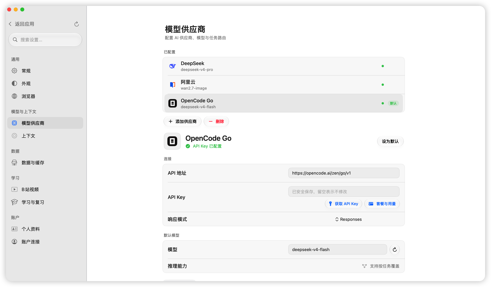
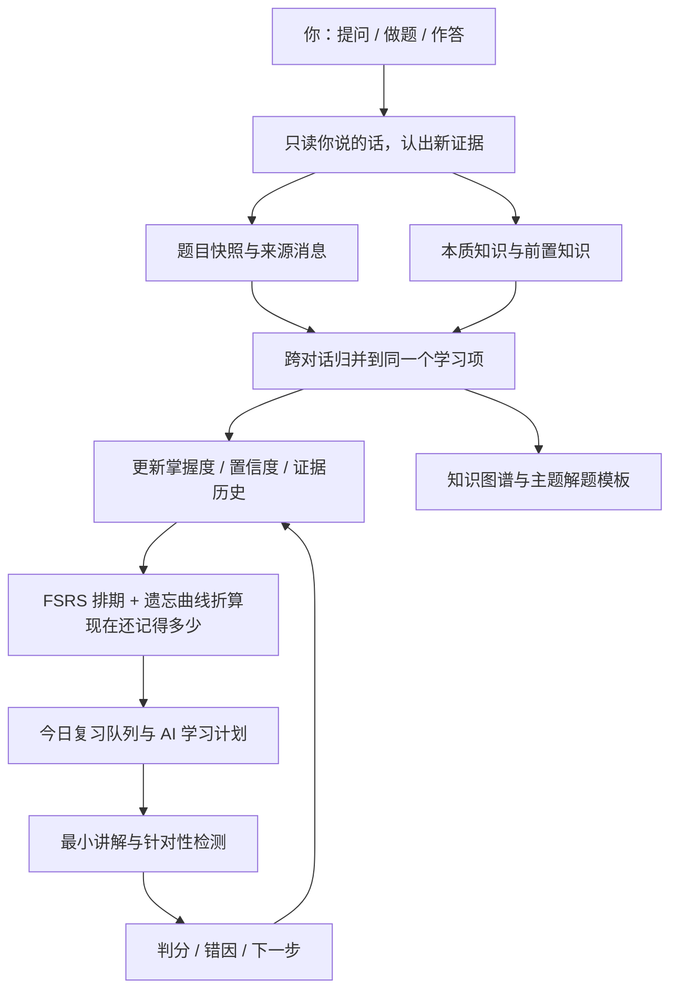

<p align="center">
  
</p>

<h1 align="center">力扣 AI 助手 2.0</h1>

<p align="center"><strong>你只管问、只管写，剩下的它替你记着。</strong></p>

<p align="center">刷题时随口问出来的那些「这里为什么」，通常问完就忘了。这个应用把它们捞出来，理成知识点，按遗忘规律排进复习——你不用记笔记，也不用维护复习表。</p>

<p align="center">
  
  
  
  
  <a href="LICENSE"></a>
</p>

<p align="center">
  <a href="#跟别的刷题工具不一样在哪">不一样在哪</a> ·
  <a href="#从你的提问里挖出你不会的东西">从提问里挖知识</a> ·
  <a href="#一眼看完">一眼看完</a> ·
  <a href="#界面">界面</a> ·
  <a href="#能做的事">能做的事</a> ·
  <a href="#怎么跑起来">怎么跑起来</a> ·
  <a href="README.en.md">English</a>
</p>

<p align="center">
  <a href="https://github.com/huaxx-lab/leetcode-ai-helper/stargazers">
    
  </a>
</p>

<p align="center"><strong>⭐ 觉得有用的话帮忙点个 Star！非常感谢🙏 </strong></p>

---

学算法最烦的从来不是不会，是「上周明明搞懂过」。笔记要自己记，标签要自己打，复习表要自己排——维护这些比刷题还累，坚持两周基本就散了。

这个应用把这部分接过去了。你照常提问、照常写代码、照常提交，它在旁边把你暴露出来的缺口整理成知识点，判断你到底掌握到什么程度，再决定哪天该把它翻出来重练。

| 你做的 | 它在后台做的 |
| --- | --- |
| 问一句「这里为什么是 j >= 0」 | 认出这是个知识缺口，归到「二分查找」下面，记下来源那条消息 |
| 提交一次代码，挂了 | 读编译错误和失败用例，写清这次错在哪、下次该注意什么 |
| 隔天又问了类似的问题 | 合并到同一个知识点上，证据 +1，而不是新建一张重复卡片 |
| 三周没碰这道题 | 按遗忘曲线算出你现在大概只剩六成记得住，把它排进今日复习 |

<a id="跟别的刷题工具不一样在哪"></a>

## 跟别的刷题工具不一样在哪

先说最直接的：**这是一个真正的 macOS 原生应用**，不是网页套壳。2.0 用 SwiftUI 重写了全部界面，Swift 6 严格并发。安装包 9MB，冷启动只读必要索引、其余后台补齐，滚动是原生的，也不用为一个学习工具常年挂着一个 Chromium。

| | 常见的 AI 刷题工具 | 这个 |
| --- | --- | --- |
| 形态 | 网页或套壳客户端，动辄一百多 MB | 原生 macOS 应用，9MB |
| 你得到什么 | 答案、题解 | 方向和卡点，代码还是你自己写 |
| 怎么算「学会了」 | 打卡数、刷题数 | 看你的提问、提交和作答，还要减去忘掉的部分 |
| 复习怎么排 | 固定间隔提醒 | FSRS 间隔 + 遗忘曲线 + 薄弱度，天天重排 |
| 笔记谁维护 | 你自己 | AI 从真实题目长出知识树，你只补自己想写的 |
| 花了多少钱 | 说不清 | 按供应商、模型、任务分别记账，精确和估算分开 |

<a id="从你的提问里挖出你不会的东西"></a>

## 从你的提问里挖出你不会的东西

这是整个应用的起点，也是它跟「AI 聊天窗 + 收藏夹」最不一样的地方。

你不需要点「加入学习」，也不用打标签。正常聊就行：问题目条件、问某个 API 怎么用、问为什么这样写会越界。这些话本身就是最好的学习材料——**它们精确指出了你不会什么**。

应用只读你说的话，不读模型的回答。模型讲得再好也只是它会，不是你会。

从这些消息里它做四件事：

1. **判断是不是学习内容。** 闲聊不生成条目；算法题记成题目，语法、标准库 API、数据结构、工程工具这些记成知识点。
2. **归到固定分类里。** 知识路径来自一份受控词表（算法与解题模式、数据结构、编程语言、常用 API、工程与工具、计算机基础），不让模型每次自创目录——否则图谱几周就烂了。
3. **判断你到什么程度。** 缺口、卡住、正在学、能用、讲得清、已掌握，每条判断都带置信度，后面的表现可以推翻前面的。看过答案不算掌握。
4. **跨对话合并。** 同一个知识点用一个稳定的键归并，下次再问是证据累积，不是又冒出一张一样的卡片。

举个真的例子：你在对话里问「Java 里栈和队列能不能存数组，怎么把数组组成二维数组」——它变成「常用 API › 集合框架」下的一个知识点，诊断写着「对集合存储数组和二维数组的创建方式存在疑问」，挂进知识图谱，也进了复习队列。你什么都没做。

<p align="center">
  
</p>

图里每个分支的百分比是「你现在还记得多少」，不是当初学会时的分数。删掉一个知识点，挂在它上面的笔记和链接会一起清掉，不会留下指向空气的虚线。

<a id="一眼看完"></a>

## 一眼看完

<table>
<tr>
<td width="33%" valign="top">

### 🖥 原生的

SwiftUI + Swift 6，9MB 安装包，启动快、滚动不掉帧。

</td>
<td width="33%" valign="top">

### 🧠 会遗忘的掌握度

「学过」和「现在还会」是两回事，全应用只认后一个数。

</td>
<td width="33%" valign="top">

### 💡 只指路

写代码时的提示分三级，读你的代码，但不替你写。

</td>
</tr>
<tr>
<td valign="top">

### 🗺 自己长大的图谱

知识树从真实题目派生，你只补自己的笔记；点哪段改哪段。

</td>
<td valign="top">

### 🧾 账算得清

十类任务分别路由，Token 按供应商 / 模型 / 任务记账。

</td>
<td valign="top">

### 🗄 先本机，后端可选

数据默认留本机；要多端共用再接 Redis 和 pgvector。

</td>
</tr>
</table>

<a id="界面"></a>

## 界面

### 刷题：题面、判题、提示都在一块屏幕里

<table>
<tr>
<td width="50%" align="center"><br><sub><b>每次提交单独复盘</b>：编译错误、失败用例、源码差异各归各的，最后落成「待巩固 / 下一步」</sub></td>
<td width="50%" align="center"><br><sub><b>卡住了再要提示</b>：先给方向，还想不出来再指卡点，最后才说下一步——始终不给完整解法</sub></td>
</tr>
<tr>
<td width="50%" align="center"><br><sub><b>能写代码的编辑器</b>：语法检查、格式化，接上 Eclipse JDT LS 就有类型与 API 补全</sub></td>
<td width="50%" align="center"><br><sub><b>计划表不用自己填</b>：AI 决定先学什么，排到哪天哪个时段由本地按你的配额算</sub></td>
</tr>
</table>

### 对话、浏览器与模型

<table>
<tr>
<td width="50%" align="center"><br><sub><b>右边是真的浏览器</b>：多标签、能登录、能看题解；代码块和左边对话共用同一套高亮与复制</sub></td>
<td width="50%" align="center"><br><sub><b>模型你自己选</b>：主对话用贵的、跑标题用便宜的都行；Key 存钥匙串，界面只显示「已配置」</sub></td>
</tr>
</table>

<a id="能做的事"></a>

## 能做的事

### 学习这条线

| | |
| --- | --- |
| **只看新东西** | 每次只分析还没处理过的消息和提交，不重复烧同一段上下文 |
| **同一个知识点只有一张卡** | 跨对话用稳定的键合并，证据往上加 |
| **从题目里挖概念** | 一道题拆成算法模式 / 数据结构 / 语言机制 / 常用 API |
| **掌握度会被推翻** | 每条证据带置信度，今天做出来了就能改写上周的判断 |
| **忘掉的部分算进去** | FSRS 保持率折算出「现在还剩多少」，全应用一个口径 |
| **今日复习** | 按配额出队，逾期的、忘得多的排前面，也能自己打分 |
| **复习要动手** | 出选择、简答、代码补全或编程题，判分结果写回掌握度和下次到期 |
| **模板自己长出来** | 同一主题题目够多了，归纳适用条件、步骤、常见坑和可编译骨架 |
| **学习洞察** | 主题分布、薄弱项、未来几天到期量、掌握趋势 |
| **回收站** | 删错了能捡回来 |

### 力扣这条线

| | |
| --- | --- |
| **在应用里登录** | 力扣中国站跑在自己的隔离会话里，微信 / QQ / GitHub 弹窗登录都能过 |
| **题单与同步** | 导入热题 100 之类的题单，按 `titleSlug` 直接取提交记录 |
| **题面原生渲染** | 示例、约束、提示都在，代码块和别处一个样 |
| **跑样例、交判题** | 提交后轮询判题结果，编译错误 / 失败用例 / 通过数 / 耗时内存都解析出来 |
| **在线翻题解** | 官方和社区题解直接看，多图收进轮播，题解视频就地播 |
| **题目操作栏** | 点赞、讨论、收藏、分享、官方提示、当前多少人在做 |
| **上一题 / 下一题** | 顺着题单连着刷，不用回列表 |
| **活动热力图** | 提交热力图、连击、周节奏、难度分布 |

### 对话这条线

| | |
| --- | --- |
| **流式回答** | 边生成边看，随时打断；推理档位关 / 低 / 高 / 最高 |
| **上下文看得见** | 占了多少、还剩多少、离压缩还有多少 Token，都写在界面上 |
| **滚动摘要** | 快到上限时后台先把摘要备好，系统指令和当前题目一定保住 |
| **长对话不迷路** | 按问题跳转，长提问自动折叠，一键回到底部 |
| **跨对话记忆** | 不记 / 只建索引 / 检索回填三档，自己选 |
| **图片** | 只收 HTTPS，去重限量，只有支持视觉的模型才带上 |

### 浏览器与工具区

| | |
| --- | --- |
| **真多标签** | 工具标签和网页标签排一条，多了自动变窄，拖动跟手换位 |
| **会话恢复** | 关掉再开还是那几个标签，不想要可以关掉 |
| **历史与下载** | 历史能查能删，下载可以每次问你存哪 |
| **弹窗能用** | `window.open` 和 `target=_blank` 正常工作，OAuth 登录不会把原页面冲掉 |
| **切走就暂停** | 后台标签不偷偷放视频 |
| **链接去哪开** | 应用内还是系统浏览器，自己定 |
| **B 站视频** | 只有 AI 判断确实值得系统学时才出现入口 |

### 模型与用量

| | |
| --- | --- |
| **供应商随便换** | 内置 DeepSeek / 阿里云 / OpenCode Go，兼容接口也能加，模型名可以手填 |
| **十类任务分开路由** | 主对话、标题摘要、视频匹配、证据分析、学习计划、讲解出题、作答评分、提交分析、跨对话记忆、写代码提示 |
| **账本** | 输入、输出、缓存、推理 Token 和工具调用，按对话 / 任务 / 供应商 / 模型分开记 |
| **不糊弄** | 供应商回传的才算精确用量，其余明确标成估算 |
| **失败也记** | 结构化任务要等解码、语义校验、本地处理都过了才算成功 |
| **Key 的去处** | 系统钥匙串，界面只显示「已配置」，供应商地址过 HTTPS 策略校验 |

### 界面本身

| | |
| --- | --- |
| **液态玻璃** | 卡片、胶囊、弹层一套材质，背后铺渐变才折射得出来 |
| **滚动条自绘** | 滚起来淡入、停下淡出，不占布局宽度 |
| **动效有出处** | 选择、面板、淡入各有时序；拖拽用补间，连线和卡片同一帧动 |
| **窗口** | 置顶、全屏、跨屏位置记忆、单实例守卫 |
| **外观** | 跟随系统 / 浅色 / 深色，字号随系统文字大小走 |
| **测试** | 原生侧 216 项 XCTest + 100 项 Swift Testing，Electron 侧 103 项，全绿才发 |

## 它是怎么转起来的

你只管产生真实的学习行为，剩下的它自己接。原始提问和判题结果说明发生了什么，AI 负责结构化和归因，调度器负责决定下一步学什么。



三条底线：模型的回答不算你的学习证据；看过题解不等于掌握；历史尝试只追加、不覆盖。所以任何一个掌握判断，都能翻回到某一次具体的提问、提交或作答。

## 关于隐私和安全

- 仓库里没有 API Key、Cookie、SSH 私钥或服务器地址。
- 原生版的供应商密钥存系统钥匙串，Electron 版用 `safeStorage` 加密；界面都只显示是否已配置，不回显原文。
- 为了生成回答、摘要和提交分析，题目、提问和相关代码会发给你选的那家供应商——按对方的隐私政策挑模型和账号。
- 对话、学习项、提交分析以 JSON 存在本机应用数据目录，目前不做静态加密。分享日志或备份前先看一眼内容。
- 力扣和哔哩哔哩的登录状态留在应用自己的隔离会话里，不写进仓库。
- 远程 Java 补全默认关闭，要显式配环境变量才启用。
- `.env.local`、构建产物、依赖目录、调试截图、私钥文件都在 `.gitignore` 里。

细节见 [SECURITY.md](SECURITY.md)。

<a id="怎么跑起来"></a>

## 怎么跑起来

### 直接下载

[Releases](https://github.com/huaxx-lab/leetcode-ai-helper/releases/latest) 里拿 Apple Silicon 版：`.dmg` 拖进「应用程序」，或者解压 `.zip` 自己挪过去。

当前是 ad-hoc 本地签名、没过 Apple 公证，首次启动请右键应用选「打开」。若提示已损坏，确认包来自本仓库后执行：

```bash
xattr -dr com.apple.quarantine "/Applications/LeetCode AI 助手.app"
```

### 自己构建（原生版 2.0）

需要 macOS 15+、Apple Silicon 和带 Swift 6 工具链的 Xcode 26。

```bash
git clone https://github.com/huaxx-lab/leetcode-ai-helper.git
cd leetcode-ai-helper/native
swift build
swift test
./scripts/build-release-app.sh      # 产出 .app + zip + dmg
```

仓库放在 iCloud / 文件提供程序托管的目录里时，资源包会长出扩展属性导致签名失败，把构建目录挪出去就行：

```bash
swift build --scratch-path /tmp/leetcode-native-build
```

### Electron 版（1.x）

老客户端还在 `src/`，脚本继续可用；需要 Node.js 22。

```bash
npm install
npm start              # 或 ./start.sh
npm run install:mac    # 构建并装到 /Applications
```

### 第一次配置

1. 设置 → 模型供应商，选 DeepSeek、阿里云、OpenCode Go，或者自己加一个。
2. 填 API 地址、Key 和模型，刷新模型列表保存；想让不同任务走不同模型就在下面分别指定。
3. 在内置浏览器里登录力扣中国站。
4. 导入题单或同步提交记录，然后就能在题目工作区里跑、交、看分析了。

数据在 `~/Library/Application Support/leetcode-ai-helper/`，删仓库或重新构建都不会动它。发问题日志前记得先把账号、代码、题目历史和凭据删掉。

## 可选的后端服务

三个都可以不装。不装的话分析结果和向量就落在本机文件里，Java 用本地语法检查和基础补全，功能一样能用。装了之后，多台机器上的客户端共用同一份缓存和向量库。部署脚本在 [`scripts/remote-services`](scripts/remote-services) 和 [`scripts/remote-lsp`](scripts/remote-lsp)。

| 服务 | 干什么 | 挂了会怎样 |
| --- | --- | --- |
| Redis | 分析结果、提交详情、用量计数的热缓存，两个客户端共用 | 每次调用都有超时上限，失败即熔断，回落本机文件 |
| PostgreSQL + pgvector | 跨对话检索用的 640 维向量库 | 暂停这一层两分钟，检索退回本机缓存 |
| Eclipse JDT LS | Java 补全 | 退回本地语法检查和基础补全 |

三者都只监听 `127.0.0.1`，客户端走 SSH 本地端口转发。**别在防火墙上放行 6379 / 5432 / 9092。**

### Redis 与 pgvector

```bash
scp -r scripts/remote-services ubuntu@example.com:/tmp/leetcode-services
ssh ubuntu@example.com
cd /tmp/leetcode-services
cp .env.example .env && $EDITOR .env && chmod 600 .env
docker compose up -d
```

客户端这边开隧道，然后在「设置 → 数据与缓存」里填地址、账号和密码，点测试连接（密码存钥匙串）：

```bash
ssh -f -N -L 6379:127.0.0.1:6379 -L 5432:127.0.0.1:5432 ubuntu@example.com
```

向量表应用会自己建，`init-pgvector.sql` 只是让第一次部署一步到位，顺便带上近邻索引。

### Java 补全服务

```bash
scp -r scripts/remote-lsp ubuntu@example.com:/tmp/leetcode-lsp
ssh ubuntu@example.com
cd /tmp/leetcode-lsp
sudo bash install.sh
curl http://127.0.0.1:9092/health
```

客户端把连接信息写进 `.env.local`（不会被 Git 跟踪，也别把私钥内容写进去）：

```dotenv
LEETCODE_LSP_SSH_HOST=example.com
LEETCODE_LSP_SSH_USER=ubuntu
LEETCODE_LSP_SSH_PORT=22
LEETCODE_LSP_TARGET_PORT=9092
LEETCODE_LSP_SSH_IDENTITY_FILE=/absolute/path/to/ssh_private_key
```

## 常用命令

| 命令 | 作用 |
| --- | --- |
| `cd native && swift build` | 构建原生客户端 |
| `cd native && swift test` | 原生侧回归测试 |
| `native/scripts/build-release-app.sh` | 打出 `.app` + zip + dmg |
| `npm start` / `./start.sh` | 跑 Electron 版 |
| `npm test` | Electron 侧回归测试 |
| `npm run install:mac` | 构建并安装 Electron 版 |

## 目录长什么样

```text
native/Sources/             原生客户端：视图、模型、服务与随包资源
native/Tests/               原生侧回归测试
native/scripts/             图标生成、预览与发布构建脚本
src/main/                   Electron 生命周期、IPC 与 preload 桥接
src/renderer/               Electron 版界面与样式
src/core/                   学习引擎、知识归并、代码检查与内容处理
src/integrations/           力扣、视频、模型供应商与流式协议适配
src/platform/               macOS 窗口布局、显示器配置与媒体缓存
assets/                     应用图标与供应商图标
scripts/remote-services/    可选后端：Redis + pgvector 的 compose 与初始化 SQL
scripts/remote-lsp/         可选后端：Eclipse JDT LS 安装脚本与 systemd 单元
scripts/                    构建、签名与安装脚本
test/                       不含账号数据的回归与安全测试
docs/screenshots/           README 里的真实截图（1.x 的存档在 legacy-electron/）
docs/ui-optimization/       各界面的设计与改造记录
```

## 想参与

先读 [贡献指南](CONTRIBUTING.md)，提交前把两侧测试跑一遍。别提交真实的 API Key、Cookie、服务器地址、私钥、应用数据或构建产物。许可证 [MIT](LICENSE)。

> LeetCode 是其权利人的商标。本项目是独立的开源工具，与 LeetCode 官方没有隶属或背书关系。
