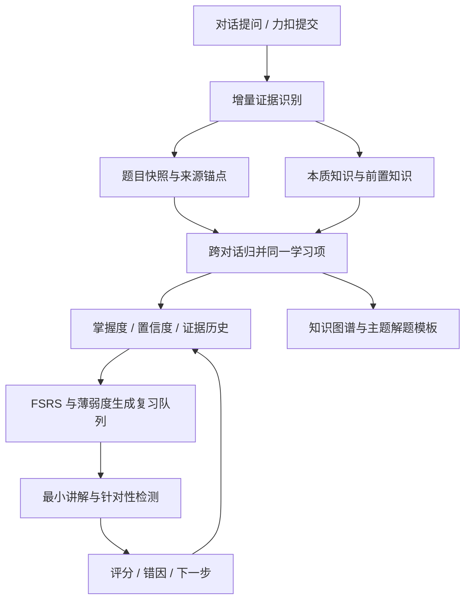

<p align="center">
  
</p>

<h1 align="center">LeetCode AI 助手</h1>

<p align="center"><strong>把每次提问和提交，转化为可追溯、可复习、会持续更新的能力证据。</strong></p>

<p align="center">面向长期能力成长的 macOS 学习工作台：连接力扣练习、AI 复盘、知识沉淀、掌握度判断与自适应复习，不再让有价值的问题散落在一次性对话里。</p>

<p align="center">
  
  
  
  
  <a href="LICENSE"></a>
</p>

<p align="center">
  <a href="#产品展示">产品展示</a> ·
  <a href="#核心亮点">核心亮点</a> ·
  <a href="#工作原理">工作原理</a> ·
  <a href="#快速开始">快速开始</a> ·
  <a href="README.en.md">English</a>
</p>

---

<a id="产品展示"></a>

## 产品展示

### 提交轨迹与 AI 复盘

每次提交都保留独立结论，结合真实判题反馈、代码变化与性能结果解释这一次为什么失败、改变了什么，以及下一步最值得修正的地方。

<p align="center">
  
</p>

<table>
  <tr>
    <td width="50%" align="center"></td>
    <td width="50%" align="center"></td>
  </tr>
  <tr>
    <td align="center"><strong>知识图谱</strong><br>把题目归入稳定知识路径，查看主题覆盖、薄弱分支与相关学习项。</td>
    <td align="center"><strong>学习洞察</strong><br>用掌握度、证据量、学习节奏和成长轨迹观察真实进展。</td>
  </tr>
  <tr>
    <td width="50%" align="center"></td>
    <td width="50%" align="center"></td>
  </tr>
  <tr>
    <td align="center"><strong>今日复习</strong><br>从到期项和薄弱项生成当天队列，在练习、反馈与再检测之间循环。</td>
    <td align="center"><strong>模型供应商</strong><br>内置 DeepSeek、阿里云与 OpenCode Go，也支持兼容接口。</td>
  </tr>
</table>

<a id="核心亮点"></a>

## 核心亮点

- **问题不是被“收藏”，而是被自动沉淀**：系统只增量分析尚未处理的用户消息与新提交，保留整理后的题目快照、来源消息和时间。跨对话再次遇到同一问题时，通过稳定的 `canonicalKey` 归并到原学习项，证据累积而不是生成重复卡片。
- **从题目表象提取本质知识**：AI 将一道具体题拆成算法模式、数据结构、语言机制或常用 API，并补充细粒度标签和必要前置知识。分类来自受控知识路径，避免模型每次自创目录导致知识图谱失控。
- **以证据判断掌握，而不是以“看过”判断掌握**：提问暴露的缺口、反复卡住、独立应用、正确解释、提交结果和检测作答都会形成带置信度的能力信号。掌握分数、证据数和最近状态随新证据更新，后续表现可以推翻旧判断。
- **每次提交都有自己的学习轨迹**：系统按 `submissionId` 读取编译错误、运行错误、失败用例、通过数、源码差异和性能变化，为每次尝试保存独立分析。新方法不会复用旧结论，累计总结也不会被较早的迟到任务倒写覆盖。
- **复习计划由薄弱度和记忆规律共同驱动**：基于 FSRS 调度复习间隔，再结合掌握分数、置信度、逾期程度和薄弱项排序生成今日队列。复习不是固定提醒，而是随着新证据动态重排。
- **复习必须产生新的能力证据**：系统针对当前最小知识缺口生成短讲解和选择、简答、代码补全或编程检测；判分会给出实际优势、缺口与下一步，并把结果重新写回掌握度和下一次复习时间。
- **知识图谱最终沉淀为可复用方法**：学习项按稳定主题聚合，展示覆盖率、掌握分布和关联题目。当同一主题积累足够题目后，系统自动归纳适用条件、操作步骤、常见错误和可编译的通用代码骨架，而不是保存某一道题的答案。
- **辅助能力保持克制且可替换**：视频入口只对力扣题目或明确值得独立学习的知识点出现；AI 路由支持 DeepSeek、阿里云、OpenCode Go 与兼容接口；Java 可选接入 Eclipse JDT LS，本地基础能力不依赖远程服务。

<a id="工作原理"></a>

## 工作原理

应用围绕“证据”组织学习，而不是围绕聊天次数组织内容。原始提问与判题结果负责说明发生了什么，AI 负责结构化与归因，调度器负责决定接下来学什么。



这条链路遵守三个原则：模型回答本身不算学习证据；看过题解不等于掌握；历史尝试只追加、不覆盖，因此任何掌握判断都能追溯到具体提问、提交或检测结果。

## 安全设计

- 仓库不包含 API Key、账号 Cookie、SSH 私钥或服务器地址。
- AI 供应商密钥在应用设置中填写，写入本机前通过 Electron `safeStorage` 加密；旧版明文配置会在启动后自动迁移。
- 力扣和哔哩哔哩登录状态保存在 Electron 的隔离会话中，不写入仓库。
- 远程 Java 补全默认关闭，必须通过本地环境变量显式启用。
- `.env.local`、构建产物、依赖目录和私钥文件均已加入 `.gitignore`。

更多说明见 [SECURITY.md](SECURITY.md)。

<a id="快速开始"></a>

## 快速开始

### 环境要求

当前构建和安装流程针对 Apple Silicon macOS：

- macOS 13 或更高版本；
- Node.js 22 和 npm；
- Xcode Command Line Tools；
- Python 3，供 `node-gyp` 编译原生模块；
- 一个受支持 AI 供应商的 API Key。

安装命令行工具：

```bash
xcode-select --install
```

建议通过 `nvm`、`fnm` 或 Homebrew 安装 Node.js 22。项目依赖 Electron 原生模块，不建议跳过安装脚本。

### 安装并运行

```bash
git clone https://github.com/huaxx-lab/leetcode-ai-helper.git
cd leetcode-ai-helper
npm install
npm start
```

macOS 若阻止本地 Electron 二进制运行，可以使用项目启动脚本，它会清理隔离属性并进行本地临时签名：

```bash
chmod +x start.sh
./start.sh
```

### 首次配置

1. 打开设置，选择 DeepSeek、阿里云、OpenCode Go 或添加自定义供应商。
2. 填写 API Base URL、API Key 和模型，刷新模型列表并保存。
3. 打开“学习活动 > 力扣”，登录力扣中国站。
4. 导入题单或同步提交记录，即可进入题目工作区运行、提交和查看 AI 分析。

应用数据保存在：

```text
~/Library/Application Support/leetcode-ai-helper/
```

删除仓库或重新构建不会删除这部分数据。提交问题日志前，请移除账号、代码、题目历史和任何凭据内容。

<a id="构建项目"></a>

## 构建项目

生成 Apple Silicon `.app` 和签名后的 zip：

```bash
npm run package:mac
```

产物位于：

```text
dist.noindex/mac-arm64/LeetCode 助手.app
dist.noindex/LeetCode-助手-mac-arm64.zip
```

直接替换安装到 `/Applications`：

```bash
npm run install:mac
```

默认使用 ad-hoc 本地签名。若本机钥匙串中有有效的 Developer ID Application 证书，可指定：

```bash
MAC_CODE_SIGN_IDENTITY="Developer ID Application: Example (TEAMID)" npm run package:mac
```

## 可选：远程 Java 补全

不配置远程服务时，应用仍可使用本地语法检查和基础补全。远程服务通过 SSH 本地端口转发访问，服务端 HTTP 网关只监听 `127.0.0.1`。

### 1. 部署服务端

准备一台 Debian/Ubuntu 服务器，将目录上传后执行安装脚本：

```bash
scp -r scripts/remote-lsp ubuntu@example.com:/tmp/leetcode-lsp
ssh ubuntu@example.com
cd /tmp/leetcode-lsp
sudo bash install.sh
```

脚本会安装 Java 21、Eclipse JDT LS 和 systemd 服务。检查状态：

```bash
sudo systemctl status leetcode-lsp
curl http://127.0.0.1:9092/health
```

不要在防火墙中公开 9092 端口；客户端通过 SSH 隧道访问它。

### 2. 配置客户端

```bash
cp .env.example .env.local
```

编辑 `.env.local`：

```dotenv
LEETCODE_LSP_SSH_HOST=example.com
LEETCODE_LSP_SSH_USER=ubuntu
LEETCODE_LSP_SSH_PORT=22
LEETCODE_LSP_TARGET_PORT=9092
LEETCODE_LSP_SSH_IDENTITY_FILE=/absolute/path/to/ssh_private_key
```

确保 SSH 密钥权限正确，并可在无交互模式下连接：

```bash
chmod 600 /absolute/path/to/ssh_private_key
ssh -o BatchMode=yes ubuntu@example.com true
./start.sh
```

`.env.local` 不会被 Git 跟踪。不要把私钥内容放进环境文件。

## 常用命令

| 命令 | 作用 |
| --- | --- |
| `npm start` | 准备前端依赖并启动开发应用 |
| `./start.sh` | 加载 `.env.local`、本地签名 Electron 后启动 |
| `npm run rebuild:native` | 为当前 Electron 版本重编译 macOS 原生模块 |
| `npm run package:mac` | 构建 `.app` 和 zip |
| `npm run install:mac` | 构建并安装到 `/Applications` |

## 项目结构

```text
src/main/                   Electron 生命周期、IPC 与安全的 preload 桥接
src/renderer/               桌面界面、交互状态和视觉样式
src/core/                   学习引擎、知识归并、代码检查与内容处理
src/integrations/           力扣、视频、模型供应商与流式协议适配
src/platform/               macOS 窗口布局、显示器配置与媒体缓存
assets/                     应用图标与供应商图标
native/                     macOS 原生 Liquid Glass 与窗口能力
scripts/                    构建、签名、安装及可选远程 LSP 脚本
test/                       无账号数据的回归与安全测试
docs/screenshots/           README 使用的真实产品截图
```

## 参与开发

提交前请运行项目回归测试，不要提交真实 API Key、Cookie、服务器地址、私钥、应用数据或构建产物。许可证为 [MIT](LICENSE)。

> LeetCode 是其权利人的商标。本项目为独立开源工具，与 LeetCode 官方无隶属或背书关系。
